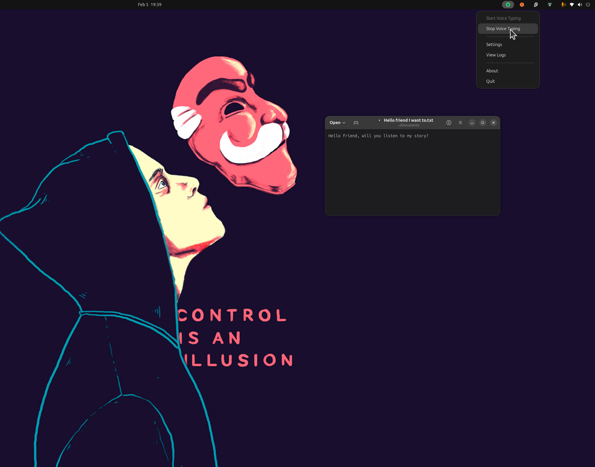
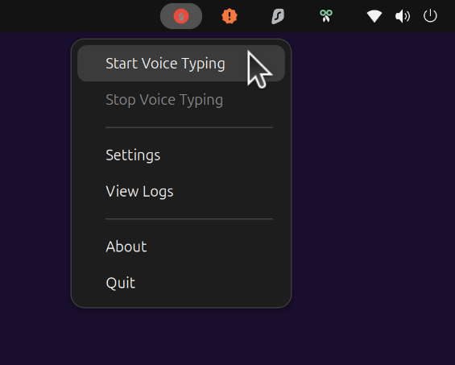
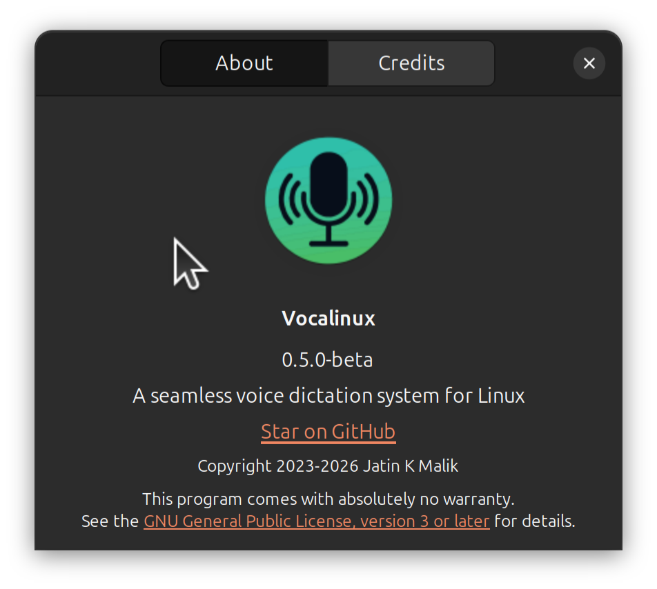
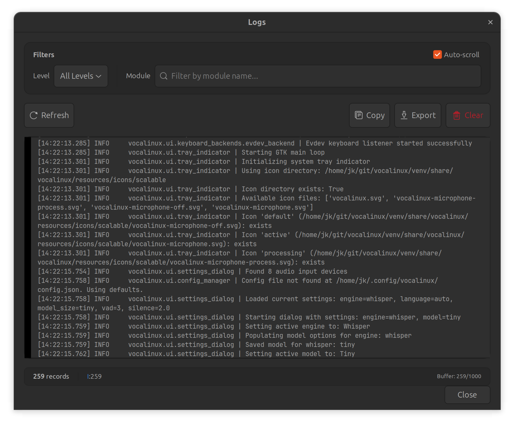
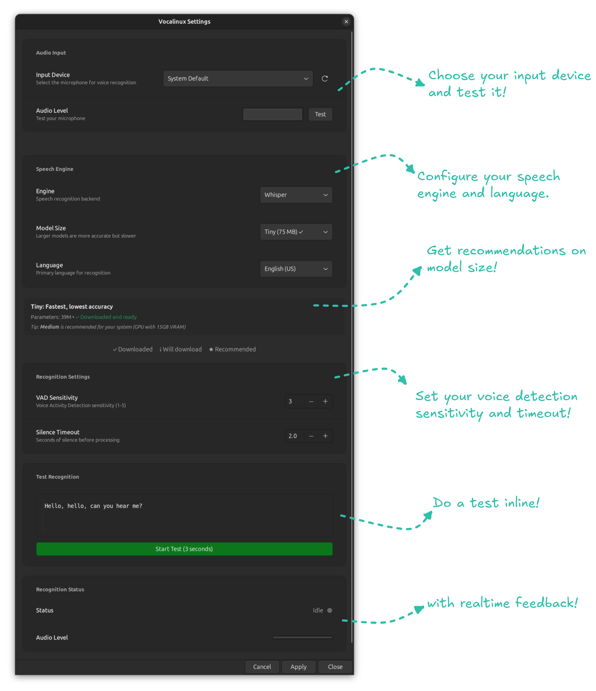

#  Vocalinux

#### Voice-to-text for Linux, finally done right!

<!-- Project Status -->
[](https://github.com/jatinkrmalik/vocalinux)
[](https://github.com/jatinkrmalik/vocalinux/releases)
[](https://www.gnu.org/licenses/gpl-3.0)


<!-- Build & Quality -->
[](https://github.com/jatinkrmalik/vocalinux/actions)
[](https://github.com/jatinkrmalik/vocalinux)
[](https://www.python.org/downloads/)
[](https://www.gtk.org/)
[](https://codecov.io/gh/jatinkrmalik/vocalinux)

<!-- Tech & Community -->
[](https://github.com/jatinkrmalik/vocalinux/stargazers)
[](https://github.com/jatinkrmalik/vocalinux/network)
[](https://github.com/jatinkrmalik/vocalinux/watchers)
[](https://github.com/jatinkrmalik/vocalinux/commits)
[](https://github.com/jatinkrmalik/vocalinux/commits)
[](CONTRIBUTING.md)
[](https://github.com/jatinkrmalik/vocalinux/issues)


**A seamless free open-source private voice dictation system for Linux**, comparable to built-in solutions on macOS and Windows.

## 📚 What's New in v0.6.2-beta

> 🎉 **Beta Release with whisper.cpp!** — Fast, private, offline voice dictation for Linux.

### 🚀 Highlights (v0.6.0 → v0.6.2)

| Feature | Description |
|---------|-------------|
| **⚡ whisper.cpp Default** | 10x faster installation (~1-2 min), C++ optimized inference |
| **🎮 Universal GPU Support** | Vulkan acceleration for AMD, Intel, and NVIDIA GPUs |
| **📦 Interactive Installer** | Choose between 3 engines with hardware auto-detection |
| **🔧 Multi-Distro Support** | Works on Ubuntu, Debian, Fedora, Arch, and more |

### ✨ New Features (v0.6.2)

- **IBus Text Injection Engine** — Full Wayland support via IBus input method
- **X11 IBus Support** — Extended IBus support to X11 for non-US keyboard layouts
- **Thread-Safe Model Access** — Improved stability with concurrent model operations

### 🐛 Bug Fixes (v0.6.2)

- **#229**: Fixed `[BLANK_AUDIO]` token suppression in whisper.cpp output
- **#228**: Removed premature pkg-config check in installer
- **#227**: Fixed text injection for non-US keyboard layouts on X11
- **#216**: Fixed thread safety crash when accessing speech models
- **#221**: Fixed missing `psutil` dependency for fresh installs
- **#219**: Suppressed `[BLANK_AUDIO]` tokens in whisper.cpp output
- **#204**: Fixed PyAudio `paInt16` error on device reconnection
- **#205**: Fixed whisper module installation with `--auto` flag

### 🔧 Recent Improvements

- **Interactive Backend Selection** — Choose GPU (Vulkan/CUDA) or CPU backend
- **Enhanced Welcome Message** — Clear post-install instructions
- **Simplified Install Commands** — No more `--tag` parameter needed
- **Better Vulkan Detection** — Improved shader package installation

---

## ✨ Features

- 🎤 **Double-tap Ctrl** to start/stop voice dictation
- ⚡ **Real-time transcription** with minimal latency
- 🌎 **Universal compatibility** across all Linux applications
- 🔒 **100% Offline operation** for privacy and reliability
- 🤖 **whisper.cpp by default** - High-performance C++ speech recognition
- 🎮 **Universal GPU support** - Vulkan acceleration for AMD, Intel, and NVIDIA
- 🎨 **System tray integration** with visual status indicators
- 🔊 **Pleasant audio feedback** - smooth gliding tones, headphone-friendly
- ⚙️ **Graphical settings** dialog for easy configuration
- 📦 **3 engine choices** - whisper.cpp (default), OpenAI Whisper, or VOSK

## 📸 Screenshots

Here are some screenshots showcasing Vocalinux in action:

<table>
  <tr>
    <td align="center">
      <br>
      <em>Real-time voice-to-text transcription</em>
    </td>
    <td align="center">
      <br>
      <em>System tray with listening indicator</em>
    </td>
  </tr>
  <tr>
    <td align="center">
      <br>
      <em>About view with version info</em>
    </td>
    <td align="center">
      <br>
      <em>Log viewer for debugging</em>
    </td>
  </tr>
  <tr>
    <td colspan="2" align="center">
      <br>
      <em>Overview of key features and configuration options with annotations</em>
    </td>
  </tr>
</table>

## 🚀 Quick Install

### Interactive Install (Recommended)

Our new interactive installer guides you through setup with intelligent hardware detection:

```bash
curl -fsSL raw.githubusercontent.com/jatinkrmalik/vocalinux/v0.6.2-beta/install.sh -o /tmp/vl.sh && bash /tmp/vl.sh
```

**Choose your engine:**
1. **whisper.cpp** ⭐ (Recommended) - Fast, works with any GPU via Vulkan
2. **Whisper** (OpenAI) - PyTorch-based, NVIDIA GPU only
3. **VOSK** - Lightweight, works on older systems

The installer will:
- **Auto-detect your hardware** (GPU, RAM, Vulkan support)
- **Recommend the best engine** for your system
- **Download the appropriate model** (~39MB for whisper.cpp tiny)
- **Install in ~1-2 minutes** (vs 5-10 min with old Whisper)

> **Note**: Installs v0.6.2-beta. For other versions, check [GitHub Releases](https://github.com/jatinkrmalik/vocalinux/releases).

### Installation Options

**Default (whisper.cpp - recommended):**
```bash
curl -fsSL raw.githubusercontent.com/jatinkrmalik/vocalinux/v0.6.2-beta/install.sh -o /tmp/vl.sh && bash /tmp/vl.sh
```
Fastest installation (~1-2 min), universal GPU support via Vulkan.

**Whisper (OpenAI) - if you prefer PyTorch:**
```bash
curl -fsSL raw.githubusercontent.com/jatinkrmalik/vocalinux/v0.6.2-beta/install.sh -o /tmp/vl.sh && bash /tmp/vl.sh --engine=whisper
```
NVIDIA GPU only (~5-10 min, downloads PyTorch + CUDA).

**VOSK only - for low-RAM systems:**
```bash
curl -fsSL raw.githubusercontent.com/jatinkrmalik/vocalinux/v0.6.2-beta/install.sh -o /tmp/vl.sh && bash /tmp/vl.sh --engine=vosk
```
Lightweight option (~40MB), works on systems with 4GB RAM.

### Alternative: Install from Source

```bash
# Clone the repository
git clone https://github.com/jatinkrmalik/vocalinux.git
cd vocalinux

# Run the installer (will prompt for Whisper)
./install.sh

# Or with Whisper support
./install.sh --with-whisper
```

The installer handles everything: system dependencies, Python environment, speech models, and desktop integration.

### After Installation

```bash
# If ~/.local/bin is in your PATH (recommended):
vocalinux

# Or activate the virtual environment first:
source ~/.local/bin/activate-vocalinux.sh
vocalinux

# Or run directly:
~/.local/share/vocalinux/venv/bin/vocalinux
```

Or launch it from your application menu!

## 📋 Requirements

- **OS**: Linux (tested on Ubuntu 22.04+, Debian 11+, Fedora 39+, Arch Linux, openSUSE Tumbleweed)
- **Python**: 3.8 or newer
- **Display**: X11 or Wayland
- **Hardware**: Microphone for voice input

**Note:** See [Distribution Compatibility](docs/DISTRO_COMPATIBILITY.md) for distribution-specific information and experimental support for Gentoo, Alpine, Void, Solus, and more.

## 🎙️ Usage

### Voice Dictation

1. **Double-tap Ctrl** to start recording
2. Speak clearly into your microphone
3. **Double-tap Ctrl** again (or pause speaking) to stop

### Voice Commands

| Command | Action |
|---------|--------|
| "new line" | Inserts a line break |
| "period" / "full stop" | Types a period (.) |
| "comma" | Types a comma (,) |
| "question mark" | Types a question mark (?) |
| "exclamation mark" | Types an exclamation mark (!) |
| "delete that" | Deletes the last sentence |
| "capitalize" | Capitalizes the next word |

### Command Line Options

```bash
vocalinux --help                  # Show all options
vocalinux --debug                 # Enable debug logging
vocalinux --engine whisper_cpp    # Use whisper.cpp engine (default)
vocalinux --engine whisper        # Use OpenAI Whisper engine
vocalinux --engine vosk           # Use VOSK engine
vocalinux --model medium          # Use medium-sized model
vocalinux --wayland               # Force Wayland mode
```

## ⚙️ Configuration

Configuration is stored in `~/.config/vocalinux/config.json`:

```json
{
  "speech_recognition": {
    "engine": "whisper_cpp",
    "model_size": "tiny",
    "vad_sensitivity": 3,
    "silence_timeout": 2.0
  }
}
```

You can also configure settings through the graphical Settings dialog (right-click the tray icon).

## 🔧 Development Setup

```bash
# Clone and install in dev mode
git clone https://github.com/jatinkrmalik/vocalinux.git
cd vocalinux
./install.sh --dev

# Activate environment
source venv/bin/activate

# Run tests
pytest

# Run from source with debug
python -m vocalinux.main --debug
```

## 📁 Project Structure

```
vocalinux/
├── src/vocalinux/                 # Main application code
│   ├── speech_recognition/        # Speech recognition engines (VOSK, Whisper, whisper.cpp)
│   │   └── recognition_manager.py # Unified engine interface
│   ├── text_injection/            # Text injection (X11/Wayland)
│   ├── ui/                        # GTK UI components
│   └── utils/                     # Utility functions
│       ├── whispercpp_model_info.py   # whisper.cpp model metadata & hardware detection
│       └── vosk_model_info.py         # VOSK model metadata
├── tests/                         # Test suite
├── scripts/                       # Development utilities
│   └── generate_sounds.py         # Sound generation script
├── resources/                     # Icons and sounds
├── docs/                          # Documentation
└── web/                           # Website source
```

## 📖 Documentation

- [Installation Guide](docs/INSTALL.md) - Detailed installation instructions
- [Update Guide](docs/UPDATE.md) - How to update Vocalinux
- [User Guide](docs/USER_GUIDE.md) - Complete user documentation
- [Contributing](CONTRIBUTING.md) - Development setup and contribution guidelines

## 🔊 Sound Customization

Vocalinux uses smooth, pleasant gliding tones for audio feedback:

- **Start**: Ascending F4→A4 (0.6s) - positive, uplifting
- **Stop**: Descending A4→F4 (0.6s) - resolves completion
- **Error**: Lower descending E4→C4 (0.7s) - gentle but noticeable

All sounds use pure sine waves with smoothstep interpolation for buttery smooth pitch transitions - perfect for headphone use!

### Regenerate Sounds

To modify or regenerate the notification sounds:

```bash
python scripts/generate_sounds.py
```

This script generates all three sounds using the same smooth glide algorithm. You can edit the frequencies, durations, and amplitudes in the script to customize the sounds to your preference.

## 🗺️ Roadmap

- [x] ~~Custom icon design~~ ✅
- [x] ~~Graphical settings dialog~~ ✅
- [x] ~~Whisper AI support~~ ✅
- [x] ~~Multi-language support (FR, DE, RU)~~ ✅
- [x] ~~whisper.cpp integration (default engine)~~ ✅
- [x] ~~Vulkan GPU support~~ ✅
- [ ] In-app update mechanism
- [ ] Application-specific commands
- [ ] Debian/Ubuntu package (.deb)
- [x] ~~Wayland support via IBus~~ ✅
- [ ] Voice command customization

## 🤝 Contributing

We welcome contributions! Whether it's bug reports, feature requests, or code contributions, please check out our [Contributing Guide](CONTRIBUTING.md).

### Quick Links

- 🐛 [Report a Bug](https://github.com/jatinkrmalik/vocalinux/issues/new?template=bug_report.md)
- 💡 [Request a Feature](https://github.com/jatinkrmalik/vocalinux/issues/new?template=feature_request.md)
- 💬 [Discussions](https://github.com/jatinkrmalik/vocalinux/discussions)


## ⭐ Support

If you find Vocalinux useful, please consider:
- ⭐ Starring this repository
- 🐛 Reporting bugs you encounter
- 📖 Improving documentation
- 🔀 Contributing code

## 📜 License

This project is licensed under the **GNU General Public License v3.0** - see the [LICENSE](LICENSE) file for details.

---

<p align="center">
  Made with ❤️ for the Linux community
</p>
