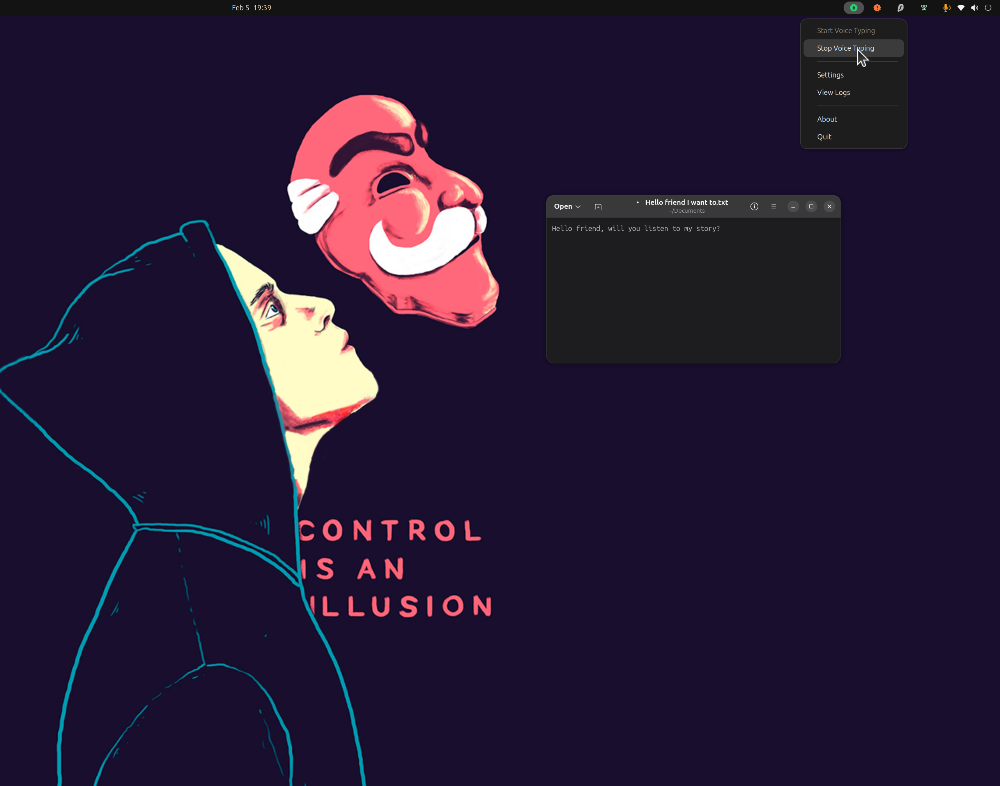
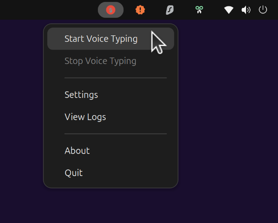
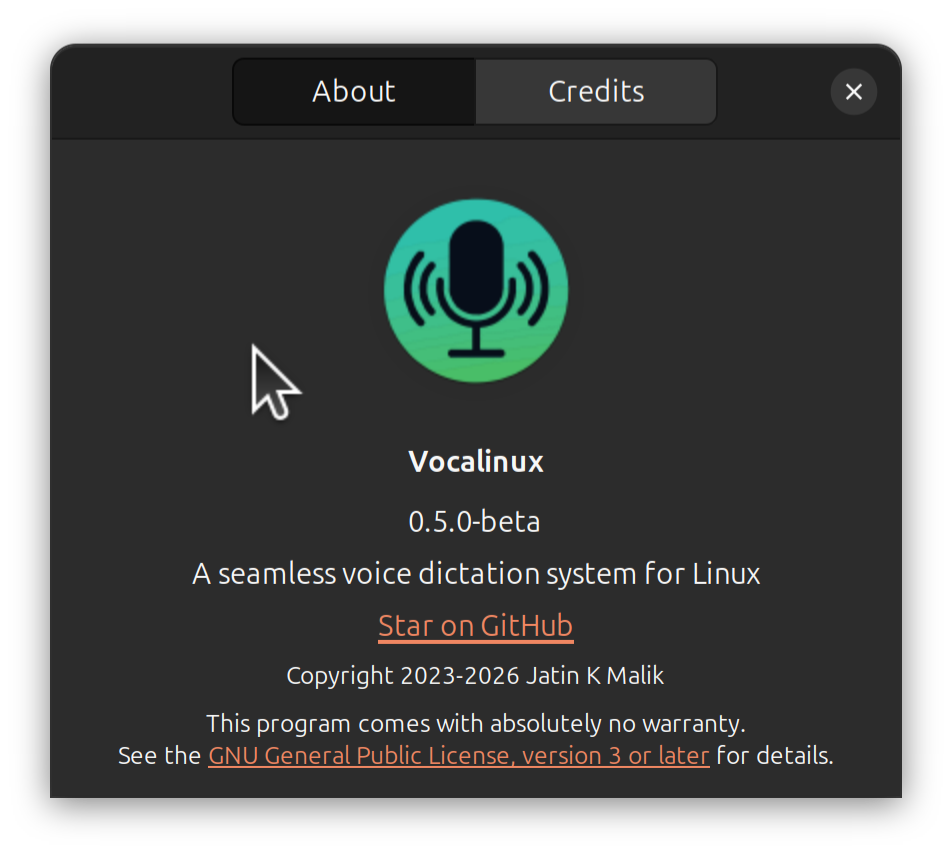
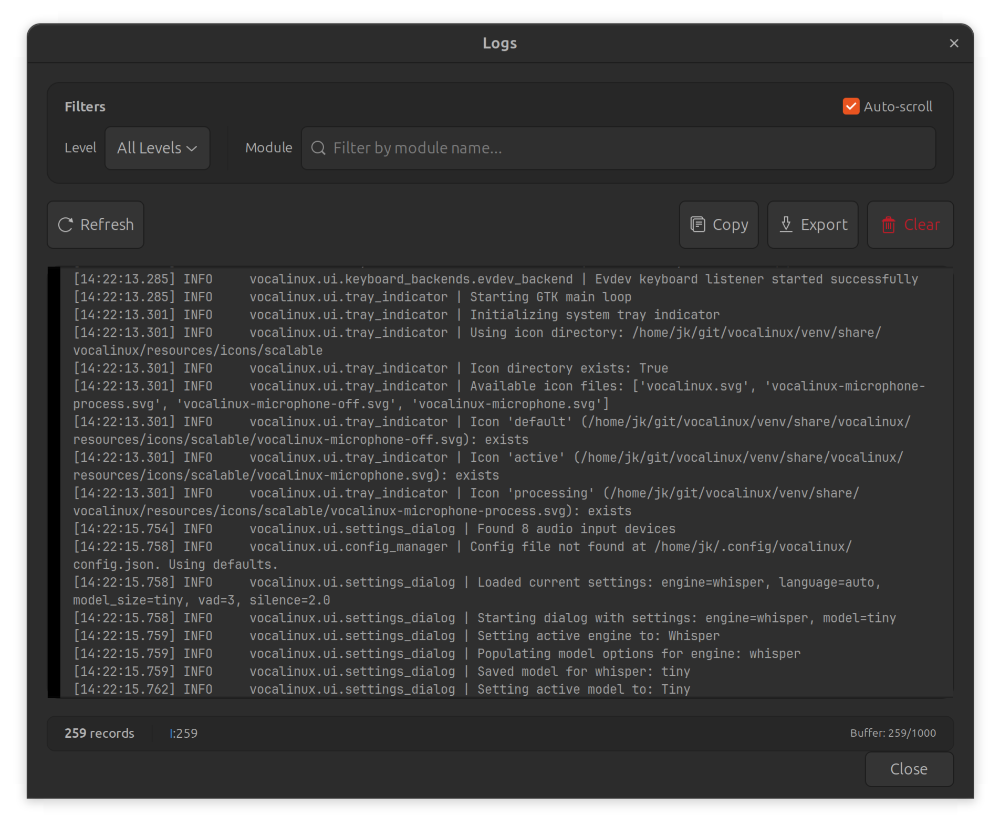
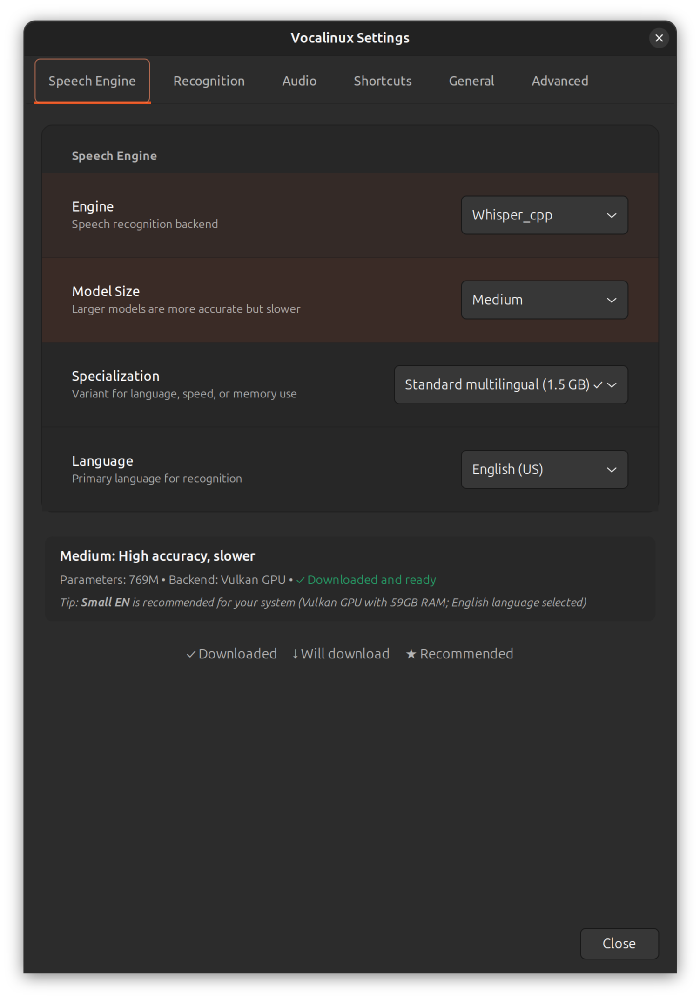
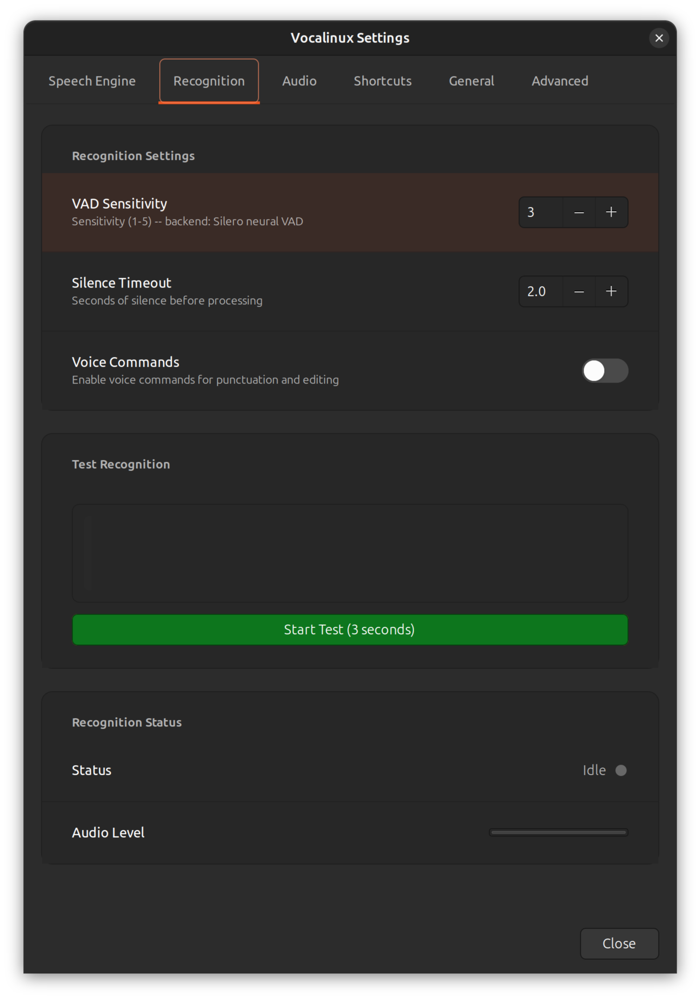
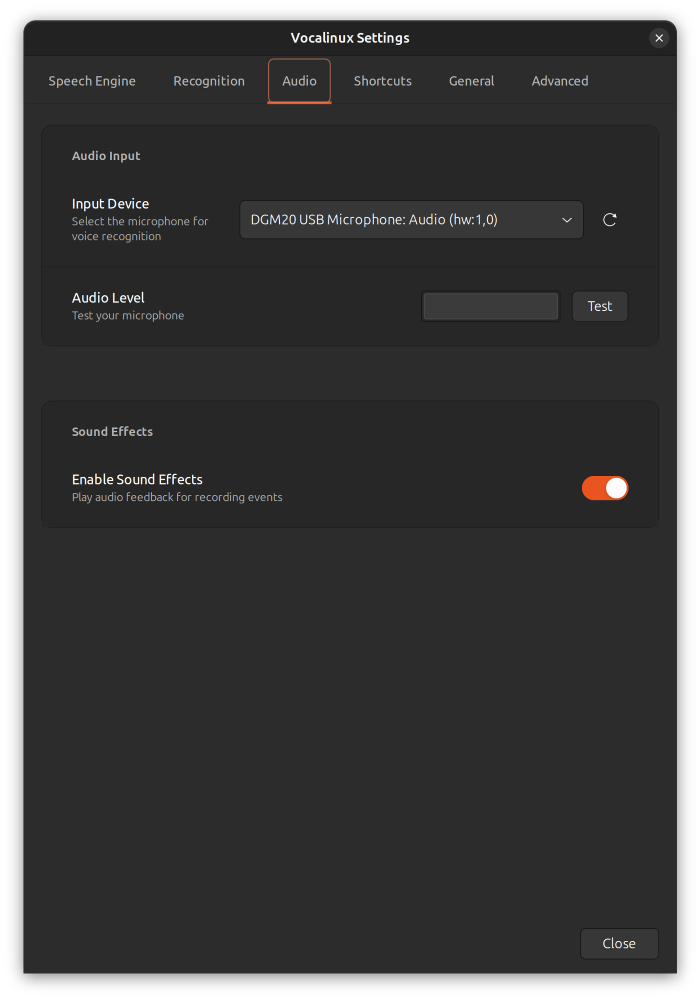
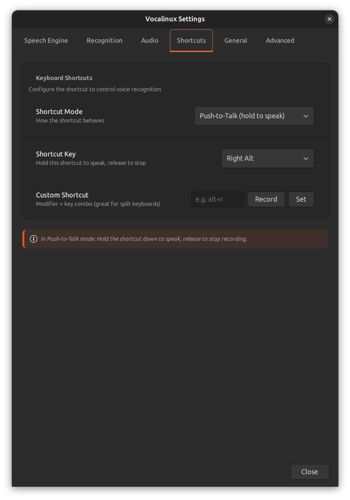
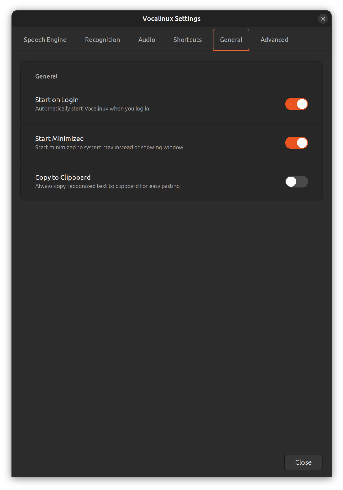
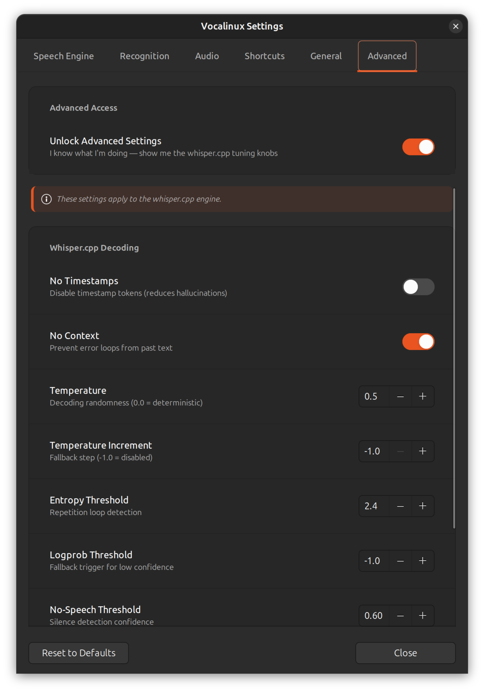

<div align="center">

#  Vocalinux

**Voice-to-text for Linux, finally done right!**

<!-- Identity: version + install paths -->
[](https://github.com/jatinkrmalik/vocalinux/releases)
[](https://www.gnu.org/licenses/gpl-3.0)
[](https://pypi.org/project/vocalinux/)
[](https://aur.archlinux.org/packages/vocalinux)

<!-- Values -->
[](https://github.com/jatinkrmalik/vocalinux#features)
[](https://github.com/jatinkrmalik/vocalinux#features)
[](CONTRIBUTING.md)

<!-- Distros (see docs for derivatives like Mint, Pop, Manjaro) -->
[](docs/DISTRO_COMPATIBILITY.md)
[](docs/DISTRO_COMPATIBILITY.md)
[](docs/DISTRO_COMPATIBILITY.md)
[](docs/DISTRO_COMPATIBILITY.md)
[](docs/DISTRO_COMPATIBILITY.md)

<!-- Quality + social (stars/forks/issues live in the GitHub UI already) -->
[](https://github.com/jatinkrmalik/vocalinux/actions)
[](https://www.python.org/downloads/)
[](https://codecov.io/gh/jatinkrmalik/vocalinux)
[](https://x.com/intent/user?screen_name=jatinkrmalik)

</div>


Linux has always punched above its weight, except when it comes to voice typing. Vocalinux fixes that.

It's a free, GPLv3-licensed desktop app that lets you dictate text into *any* application, on X11 or Wayland, using fully offline speech recognition. Pick from three engines (whisper.cpp, OpenAI Whisper, or VOSK), get automatic GPU acceleration via Vulkan, and control it all with customizable keyboard shortcuts: toggle or push-to-talk.

No internet required. No data leaves your machine. Just speak and type.

## 📚 What's New in v0.14.2

> **0.14.2 is a stability patch on the 0.14 series.** Feature set is the same as 0.14.x; this release fixes IBus reliability and settings dialog sizing.

### 0.14 series highlights

| Feature | Description |
|---------|-------------|
| **Configurable hotkeys** | Bind any modifier combination to a key (e.g. `Alt+R`, `Ctrl+Shift+V`) |
| **FunASR / SenseVoice** | Remote-API engine supports FunASR and SenseVoice models |
| **Flatpak packaging** | Distro-independent install with whisper.cpp, global hotkeys (evdev), and Wayland paste (wl-copy + ydotool) |
| **AUR package** | Arch users can install via `yay -S vocalinux` |
| **Layout-aware hotkeys** | Combo keys work correctly on non-US keyboard layouts |
| **Wayland / IBus reliability** | GNOME and KDE injection fixes, first-dictation FocusIn gate, engine process launch restored |

### Bug fixes in v0.14.2

- **IBus**: Restore engine process launch after the Flatpak XDG path import change (no silent ydotool fallback when IBus should work) (#534)
- **IBus**: Wait for FocusIn before commit on scoped injection so the first dictation of a session is not dropped on GNOME Wayland (#533, fixes #523)
- **Settings UI**: Tabs scroll so the dialog fits the monitor; wheel events from unfocused combos/spins reach the tab scroller (#538, #541)

See [docs/UPDATE.md](docs/UPDATE.md) and the [full changelog](https://github.com/jatinkrmalik/vocalinux/releases/tag/v0.14.2). Earlier 0.14.x notes are in UPDATE.md.

---

## Features

- 🎤 **Toggle or Push-to-Talk** activation modes
- ⚡ **Real-time transcription** with minimal latency
- 🌎 **Universal compatibility** across all Linux applications
- 🔒 **100% Offline operation** for privacy and reliability
- 🤖 **whisper.cpp by default** - High-performance C++ speech recognition
- 🎮 **Universal GPU support** - Vulkan acceleration for AMD, Intel, and NVIDIA
- 🎨 **System tray integration** with visual status indicators
- 🚀 **Start on login support** via XDG autostart (desktop-session startup)
- 🔊 **Pleasant audio feedback** - smooth gliding tones, headphone-friendly
- ⚙️ **Graphical settings** dialog for easy configuration
- 📦 **3 engine choices** - whisper.cpp (default), OpenAI Whisper, or VOSK

## 📸 Screenshots

Vocalinux in action, plus the settings tabs from v0.14.0-beta. Full gallery on the [website screenshots page](https://vocalinux.com/screenshots/).

### Product

<table>
  <tr>
    <td align="center" width="50%">
      <br>
      <em>Real-time voice-to-text transcription</em>
    </td>
    <td align="center" width="50%">
      <br>
      <em>System tray with listening indicator</em>
    </td>
  </tr>
  <tr>
    <td align="center">
      <br>
      <em>About dialog with version info</em>
    </td>
    <td align="center">
      <br>
      <em>Log viewer for debugging</em>
    </td>
  </tr>
</table>

### Settings

<table>
  <tr>
    <td align="center" width="33%">
      <br>
      <em>Speech Engine</em>
    </td>
    <td align="center" width="33%">
      <br>
      <em>Recognition</em>
    </td>
    <td align="center" width="33%">
      <br>
      <em>Audio</em>
    </td>
  </tr>
  <tr>
    <td align="center">
      <br>
      <em>Shortcuts &amp; Hotkeys</em>
    </td>
    <td align="center">
      <br>
      <em>General</em>
    </td>
    <td align="center">
      <br>
      <em>Advanced</em>
    </td>
  </tr>
</table>

## 🚀 Quick Install

### Interactive Install (Recommended)

Our new interactive installer guides you through setup with intelligent hardware detection:

```bash
curl -fsSL raw.githubusercontent.com/jatinkrmalik/vocalinux/main/install.sh -o /tmp/vl.sh && bash /tmp/vl.sh
```

**Choose your engine:**
1. **whisper.cpp** ⭐ (Recommended) - Fast, works with any GPU via Vulkan
2. **Whisper** (OpenAI) - PyTorch-based, NVIDIA GPU only
3. **VOSK** - Lightweight, works on older systems

The installer will:
- **Auto-detect your hardware** (GPU, RAM, Vulkan support)
- **Recommend the best engine** for your system
- **Download the appropriate model** (~74MB for the default whisper.cpp tiny model)
- **Install neural VAD support** when ONNX Runtime is available
- **Install in ~1-2 minutes** (vs 5-10 min with old Whisper)

> **Note**: Always installs the latest release. For a specific version, check [GitHub Releases](https://github.com/jatinkrmalik/vocalinux/releases).

### Installation Options

**Default (whisper.cpp - recommended):**
```bash
curl -fsSL raw.githubusercontent.com/jatinkrmalik/vocalinux/main/install.sh -o /tmp/vl.sh && bash /tmp/vl.sh
```
Fastest installation (~1-2 min), universal GPU support via Vulkan.

**Whisper (OpenAI) - if you prefer PyTorch:**
```bash
curl -fsSL raw.githubusercontent.com/jatinkrmalik/vocalinux/main/install.sh -o /tmp/vl.sh && bash /tmp/vl.sh --engine=whisper
```
NVIDIA GPU only (~5-10 min, downloads PyTorch + CUDA).

**VOSK only - for low-RAM systems:**
```bash
curl -fsSL raw.githubusercontent.com/jatinkrmalik/vocalinux/main/install.sh -o /tmp/vl.sh && bash /tmp/vl.sh --engine=vosk
```
Lightweight option (~40MB), works on systems with 4GB RAM.

### Arch Linux (AUR)

```bash
yay -S vocalinux
```

See [docs/AUR.md](docs/AUR.md).

### Flatpak (any distro)

For a sandboxed, distro-independent install (great for NixOS, Fedora Silverblue,
Steam Deck, and anywhere else), build the Flatpak from the bundled manifest:

```bash
flatpak install flathub org.gnome.Platform//50 org.gnome.Sdk//50
flatpak-builder --user --install --force-clean build-dir \
  packaging/flatpak/com.vocalinux.Vocalinux.yml
flatpak run com.vocalinux.Vocalinux
```

The Flatpak ships the whisper.cpp engine with Vulkan GPU support and runs through
XWayland on Wayland sessions. See [`packaging/flatpak/README.md`](packaging/flatpak/README.md)
for build details, permissions, and Flathub submission notes. Flathub publishing
is in progress.

### Alternative: Install from Source

```bash
# Clone the repository
git clone https://github.com/jatinkrmalik/vocalinux.git
cd vocalinux

# Run the installer (will prompt for Whisper)
./install.sh

# Or with Whisper support
./install.sh --with-whisper
```

The installer handles everything: system dependencies, Python environment, speech models, and desktop integration.

### 🌙 Nightly Releases (Bleeding Edge)

For developers and early adopters who want to test the latest features, check out our [GitHub Releases page](https://github.com/jatinkrmalik/vocalinux/releases) which includes both beta and nightly builds.

> **⚠️ Warning**: Nightly releases contain the absolute latest code and may be unstable. For production use, we recommend using the latest beta release.

Nightly builds are automatically generated from the `main` branch every day. They include all merged changes but haven't undergone the same testing as beta releases.

**Release Channels:**
- **Beta** (Recommended) - Tested pre-releases with known features
- **Nightly** - Untested bleeding edge with latest commits

### After Installation

```bash
# If ~/.local/bin is in your PATH (recommended):
vocalinux

# Or activate the virtual environment first:
source ~/.local/bin/activate-vocalinux.sh
vocalinux

# Or run directly:
~/.local/share/vocalinux/venv/bin/vocalinux
```

Or launch it from your application menu!

## 📋 Requirements

- **OS**: Linux (tested on Ubuntu 22.04+, Debian 11+, Fedora 39+, Arch Linux, openSUSE Tumbleweed)
- **Python**: 3.9 or newer
- **Display**: X11 or Wayland
- **Hardware**: Microphone for voice input

**Note:** See [Distribution Compatibility](docs/DISTRO_COMPATIBILITY.md) for distribution-specific information and experimental support for Gentoo, Alpine, Void, Solus, and more.

## 🎙️ Usage

### Voice Dictation

1. **Toggle mode**: Double-tap the shortcut key (default Ctrl) to start recording
2. Speak clearly into your microphone
3. **Toggle mode**: Double-tap again (or pause speaking) to stop, or **Push-to-Talk mode**: release the key to stop

### Voice Commands

| Command | Action |
|---------|--------|
| "new line" | Inserts a line break |
| "period" / "full stop" | Types a period (.) |
| "comma" | Types a comma (,) |
| "question mark" | Types a question mark (?) |
| "exclamation mark" | Types an exclamation mark (!) |
| "delete that" | Deletes the last sentence |
| "capitalize" | Capitalizes the next word |

### Command Line Options

```bash
vocalinux --help                  # Show all options
vocalinux --debug                 # Enable debug logging
vocalinux --engine whisper_cpp    # Use whisper.cpp engine (default)
vocalinux --engine whisper        # Use OpenAI Whisper engine
vocalinux --engine vosk           # Use VOSK engine
vocalinux --model medium          # Use medium-sized model
vocalinux --model medium.en-q5_0  # Use exact whisper.cpp model variant
vocalinux --model large-v3-turbo  # Use large-v3 Turbo with whisper.cpp
vocalinux --wayland               # Force Wayland mode
vocalinux --start-minimized       # Start without first-run modal prompts
```

### Autostart on Login

Vocalinux uses the Linux desktop standard for autostart:

- **Mechanism**: XDG autostart desktop entry (`vocalinux.desktop`)
- **Path**: `$XDG_CONFIG_HOME/autostart/` or `~/.config/autostart/` (fallback)
- **Launch mode**: Starts as a regular **user desktop app** in your graphical session
- **Not used**: No `systemd` unit/service is created by Vocalinux for autostart

How to enable/disable:

- First-run welcome dialog
- Tray menu: **Start on Login**
- Settings dialog: **Start on Login**

Compatibility notes:

- Works on mainstream desktop environments (GNOME, KDE, Xfce, Cinnamon, MATE, LXQt)
- On minimal/custom window-manager sessions, an autostart handler may be required
  (for example DE-specific startup hooks or tools like `dex`)

## ⚙️ Configuration

Configuration is stored in `~/.config/vocalinux/config.json`:

```json
{
  "speech_recognition": {
    "engine": "whisper_cpp",
    "model_size": "tiny",
    "vad_sensitivity": 3,
    "silence_timeout": 2.0
  }
}
```

For whisper.cpp, `model_size` may be a size such as `tiny` or an exact ggml model ID
such as `medium.en-q5_0` or `large-v3-turbo`. You can also configure this through
the graphical Settings dialog, where whisper.cpp models are split into **Model Size**
and **Specialization** controls.

### Neural Voice Activity Detection

Vocalinux ships with a Silero VAD model and uses it automatically when `onnxruntime` is available. The official installer attempts to install this support automatically. Without it, recording falls back to the simpler amplitude-threshold VAD.

For manual or PyPI installs, enable neural VAD with:

```bash
pip install "vocalinux[vad]"
```

Restart Vocalinux after install. The Recognition tab in Settings shows which backend is active. The same `vad_sensitivity` (1-5) works for both -- it's mapped to a Silero probability threshold internally (1 = 0.8, 5 = 0.3).

## 🔧 Development Setup

```bash
# Clone and install in dev mode
git clone https://github.com/jatinkrmalik/vocalinux.git
cd vocalinux
./install.sh --dev

# Activate environment
source venv/bin/activate

# Run tests
pytest

# Run from source with debug
python -m vocalinux.main --debug
```

## 📁 Project Structure

```
vocalinux/
├── src/vocalinux/                 # Main application code
│   ├── speech_recognition/        # Speech recognition engines (VOSK, Whisper, whisper.cpp)
│   │   └── recognition_manager.py # Unified engine interface
│   ├── text_injection/            # Text injection (X11/Wayland)
│   ├── ui/                        # GTK UI components
│   └── utils/                     # Utility functions
│       ├── whispercpp_model_info.py   # whisper.cpp model metadata & hardware detection
│       └── vosk_model_info.py         # VOSK model metadata
├── tests/                         # Test suite
├── scripts/                       # Development utilities
│   └── generate_sounds.py         # Sound generation script
├── resources/                     # Icons and sounds
├── docs/                          # Documentation
└── web/                           # Website source
```

## 📖 Documentation

- [Installation Guide](docs/INSTALL.md) - Detailed installation instructions
- [Update Guide](docs/UPDATE.md) - How to update Vocalinux
- [User Guide](docs/USER_GUIDE.md) - Complete user documentation
- [Distribution Compatibility](docs/DISTRO_COMPATIBILITY.md) - Distro/session behavior and caveats
- [Contributing](CONTRIBUTING.md) - Development setup and contribution guidelines

## 🔊 Sound Customization

Vocalinux uses smooth, pleasant gliding tones for audio feedback:

- **Start**: Ascending F4→A4 (0.6s) - positive, uplifting
- **Stop**: Descending A4→F4 (0.6s) - resolves completion
- **Error**: Lower descending E4→C4 (0.7s) - gentle but noticeable

All sounds use pure sine waves with smoothstep interpolation for buttery smooth pitch transitions - perfect for headphone use!

### Regenerate Sounds

To modify or regenerate the notification sounds:

```bash
python scripts/generate_sounds.py
```

This script generates all three sounds using the same smooth glide algorithm. You can edit the frequencies, durations, and amplitudes in the script to customize the sounds to your preference.

## 🗺️ Roadmap

- [x] ~~Custom icon design~~ ✅
- [x] ~~Graphical settings dialog~~ ✅
- [x] ~~Whisper AI support~~ ✅
- [x] ~~Multi-language support (FR, DE, RU)~~ ✅
- [x] ~~whisper.cpp integration (default engine)~~ ✅
- [x] ~~Vulkan GPU support~~ ✅
- [ ] In-app update mechanism
- [ ] Application-specific commands
- [x] ~~Flatpak packaging~~ ✅ (Flathub submission in progress)
- [ ] Debian/Ubuntu package (.deb)
- [x] ~~Wayland support via IBus~~ ✅
- [ ] Voice command customization

## 🌐 The Voca Ecosystem

Vocalinux is part of a family of privacy-first, offline voice dictation tools. Same mission, every operating system.

| Platform | Project | Website | GitHub | Status |
|----------|---------|---------|--------|--------|
| 🐧 Linux | **VocaLinux** | [vocalinux.com](https://vocalinux.com) | [jatinkrmalik/vocalinux](https://github.com/jatinkrmalik/vocalinux) | ✅ Stable v0.14.2 |
| 🍎 macOS | **VocaMac** | [vocamac.com](https://vocamac.com) | [jatinkrmalik/vocamac](https://github.com/jatinkrmalik/vocamac) | 🚀 Beta |
| 🪟 Windows | **VocaWin** | [vocawin.com](https://vocawin.com) | [jatinkrmalik/vocawin](https://github.com/jatinkrmalik/vocawin) | 📋 Planned |

> Each platform uses native technologies for the best possible integration, while sharing the same privacy-first philosophy and offline-only architecture.

## 🤝 Contributing

We welcome contributions! Whether it's bug reports, feature requests, or code contributions, please check out our [Contributing Guide](CONTRIBUTING.md).

### Contributors

Thanks to everyone who has contributed to Vocalinux! 🙌

<a href="https://github.com/jatinkrmalik/vocalinux/graphs/contributors">
  
</a>

### Quick Links

- 🐛 [Report a Bug](https://github.com/jatinkrmalik/vocalinux/issues/new?template=bug_report.md)
- 💡 [Request a Feature](https://github.com/jatinkrmalik/vocalinux/issues/new?template=feature_request.md)
- 💬 [Discussions](https://github.com/jatinkrmalik/vocalinux/discussions)


## ⭐ Support

If you find Vocalinux useful, please consider:
- ⭐ Starring this repository
- 🐛 Reporting bugs you encounter
- 📖 Improving documentation
- 🔀 Contributing code

## 📜 License

This project is licensed under the **GNU General Public License v3.0** - see the [LICENSE](LICENSE) file for details.

## Star Chart

[](https://www.star-history.com/?type=date&repos=jatinkrmalik%2Fvocalinux)

---

<p align="center">
  Made with ❤️ for the Linux community
</p>
