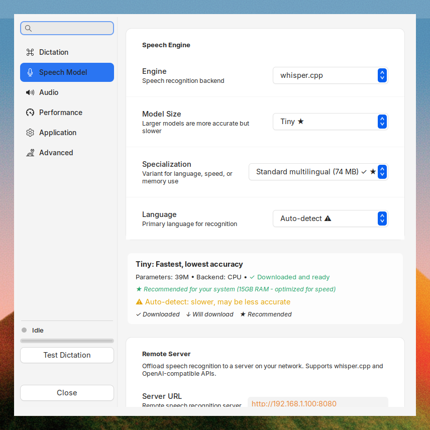
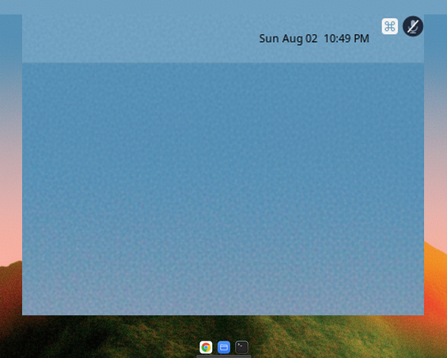
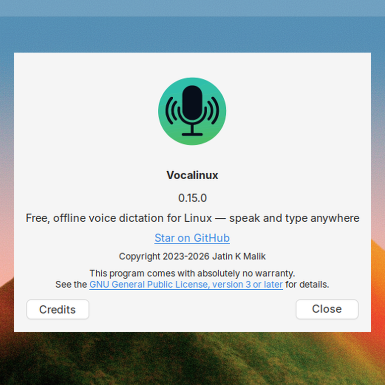
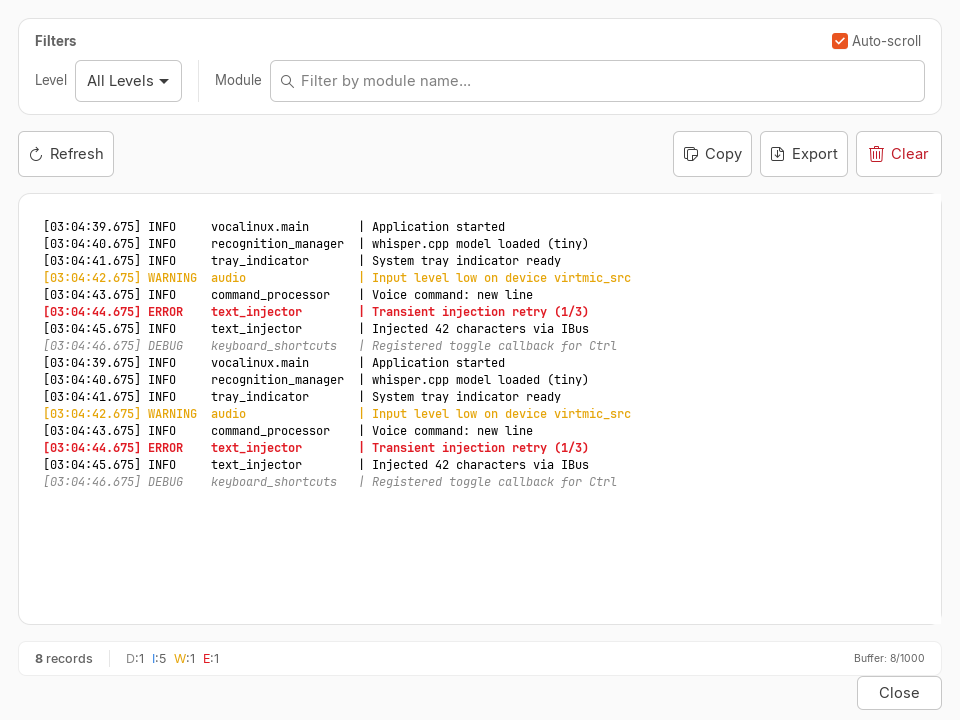
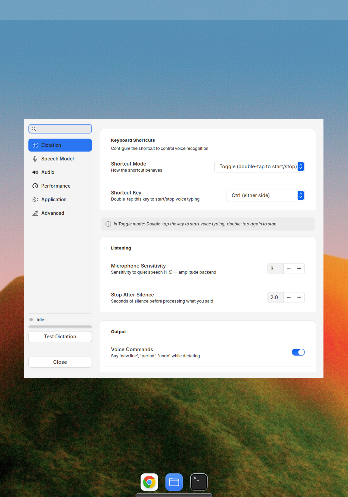
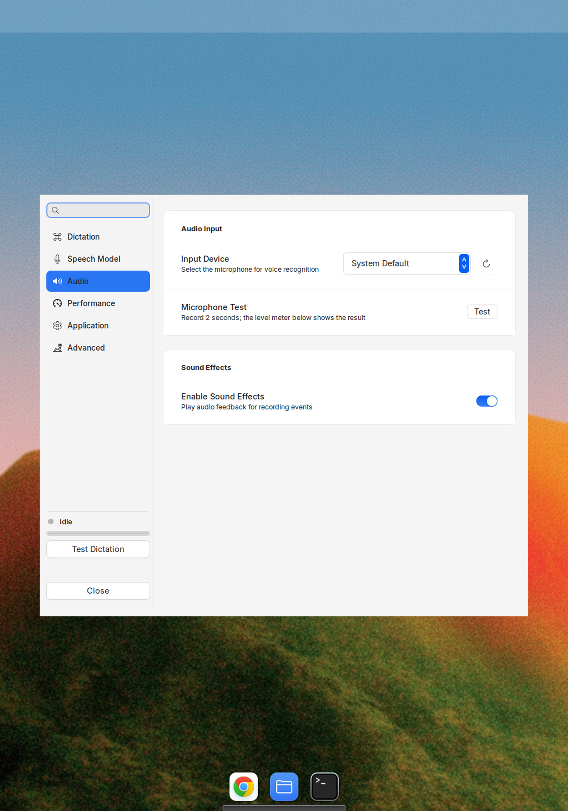
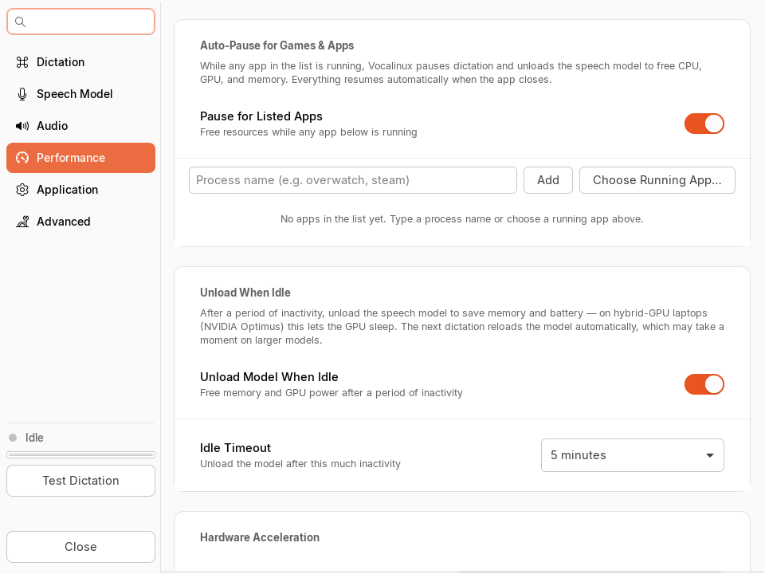
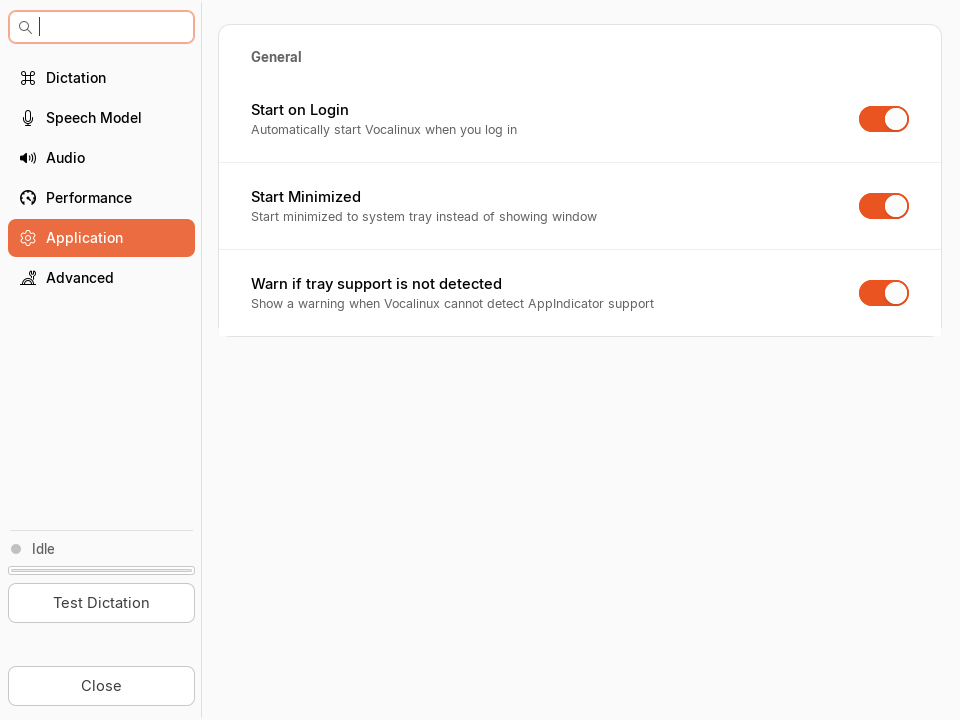
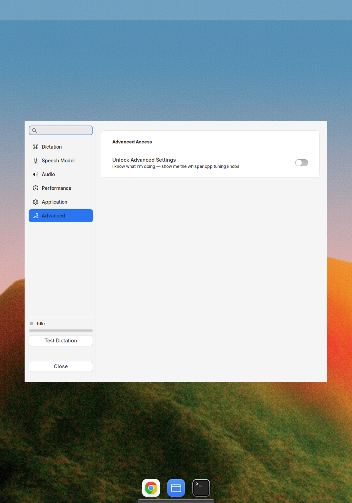

<div align="center">


# Vocalinux

**Offline voice dictation for Linux**

[](https://github.com/jatinkrmalik/vocalinux/releases)
[](https://pypi.org/project/vocalinux/)
[](https://aur.archlinux.org/packages/vocalinux)
[](https://github.com/jatinkrmalik/vocalinux/actions/workflows/unified-pipeline.yml?query=branch%3Amain)
[](https://codecov.io/gh/jatinkrmalik/vocalinux)
[](https://www.gnu.org/licenses/gpl-3.0)
[](https://www.python.org/downloads/)

[Website](https://vocalinux.com) · [Install](#install) · [Docs](#documentation) · [Releases](https://github.com/jatinkrmalik/vocalinux/releases)

</div>

Vocalinux turns speech into typed text in whatever app has focus. It runs fully offline by default (whisper.cpp, OpenAI Whisper, or VOSK), works on X11 and Wayland, and injects text into terminals, browsers, IDEs, and office apps from a system tray indicator.

No cloud account. No telemetry. Dictate on your machine.

**Current release:** [v0.15.0](https://github.com/jatinkrmalik/vocalinux/releases/tag/v0.15.0) — searchable settings, AppImage packages, expanded languages, dictation polish, power-saving model unload, and Vulkan GPU selection. See [docs/UPDATE.md](docs/UPDATE.md) for details.

## Features

- **Offline by default** — Local speech engines; audio stays on your device
- **X11 and Wayland** — Text injection via xdotool, IBus, wtype, ydotool, or clipboard fallback
- **Three engines** — whisper.cpp (default), OpenAI Whisper, or VOSK, plus optional remote HTTP API
- **GPU acceleration** — Vulkan for AMD, Intel, and NVIDIA with whisper.cpp
- **Toggle or push-to-talk** — Configurable shortcuts, including modifier+key combos
- **System tray + settings** — Searchable sidebar UI, status icons, audio feedback
- **Start on login** — XDG autostart (desktop session, not a systemd service)
- **Packaging options** — install script, AppImage, AUR, PyPI, local Flatpak build

## Screenshots

Full gallery (including dark theme): [vocalinux.com/screenshots](https://vocalinux.com/screenshots/).

### Product

<table>
  <tr>
    <td align="center" width="50%">
      <br>
      <em>Real-time voice-to-text transcription</em>
    </td>
    <td align="center" width="50%">
      <br>
      <em>System tray with listening indicator</em>
    </td>
  </tr>
  <tr>
    <td align="center">
      <br>
      <em>About &amp; Updates in Settings</em>
    </td>
    <td align="center">
      <br>
      <em>Log viewer for debugging</em>
    </td>
  </tr>
</table>

### Settings

<table>
  <tr>
    <td align="center" width="33%">
      <br>
      <em>Speech Engine</em>
    </td>
    <td align="center" width="33%">
      <br>
      <em>Recognition</em>
    </td>
    <td align="center" width="33%">
      <br>
      <em>Audio</em>
    </td>
  </tr>
  <tr>
    <td align="center">
      <br>
      <em>Performance</em>
    </td>
    <td align="center">
      <br>
      <em>General</em>
    </td>
    <td align="center">
      <br>
      <em>Advanced</em>
    </td>
  </tr>
</table>

## Install

### Recommended (interactive installer)

```bash
curl -fsSL https://raw.githubusercontent.com/jatinkrmalik/vocalinux/main/install.sh -o /tmp/vl.sh
bash /tmp/vl.sh
```

Prefer to review the script first: open `/tmp/vl.sh` before running it, or clone the repo and run `./install.sh` locally.

The installer detects hardware, recommends an engine, downloads a default model (~74MB for whisper.cpp tiny), and installs desktop integration. Typical install time with whisper.cpp is about 1–2 minutes.

| Engine | When to use |
|--------|-------------|
| **whisper.cpp** (default) | Best default; Vulkan GPU on AMD, Intel, and NVIDIA |
| **Whisper** (OpenAI) | PyTorch path; NVIDIA/CUDA |
| **VOSK** | Low RAM / minimal footprint |

Non-interactive options:

```bash
bash /tmp/vl.sh --auto                         # whisper.cpp defaults
bash /tmp/vl.sh --auto --engine=whisper        # OpenAI Whisper
bash /tmp/vl.sh --auto --engine=vosk           # VOSK only
```

For a specific release tag, see [GitHub Releases](https://github.com/jatinkrmalik/vocalinux/releases) or `./install.sh --tag=v0.15.0`.

### Arch Linux (AUR)

```bash
yay -S vocalinux
```

See [docs/AUR.md](docs/AUR.md).

### AppImage

Download the `x86_64` or `aarch64` AppImage from [Releases](https://github.com/jatinkrmalik/vocalinux/releases), mark it executable, and run it. Host text-injection tools (`xdotool` on X11; `wtype` / `ydotool` / clipboard tools on Wayland) are still required. Prefer the installer when you want system deps and models set up automatically.

### Flatpak (local build)

```bash
flatpak install flathub org.gnome.Platform//50 org.gnome.Sdk//50
flatpak-builder --user --install --force-clean build-dir \
  packaging/flatpak/com.vocalinux.Vocalinux.yml
flatpak run com.vocalinux.Vocalinux
```

Ships whisper.cpp with Vulkan. Flathub publishing is in progress. Details: [packaging/flatpak/README.md](packaging/flatpak/README.md).

### From source

```bash
git clone https://github.com/jatinkrmalik/vocalinux.git
cd vocalinux
./install.sh
```

### After installation

```bash
vocalinux                 # if ~/.local/bin is on PATH
# or
~/.local/share/vocalinux/venv/bin/vocalinux
```

You can also launch Vocalinux from your application menu.

### Nightly builds

Daily builds from `main` appear on [Releases](https://github.com/jatinkrmalik/vocalinux/releases). Use the latest stable or beta release for production; nightlies are untested.

## Requirements

| | |
|--|--|
| **OS** | Linux (Ubuntu 22.04+, Debian 11+, Fedora 39+, Arch, openSUSE Tumbleweed) |
| **Python** | 3.9+ |
| **Display** | X11 or Wayland |
| **Hardware** | Microphone; GPU optional (Vulkan) |

Distribution notes and experimental support (Mint, Pop!_OS, Gentoo, Alpine, and others): [docs/DISTRO_COMPATIBILITY.md](docs/DISTRO_COMPATIBILITY.md).

## Usage

### Dictation

1. **Toggle mode (default):** double-tap the shortcut (Ctrl by default) to start and stop
2. Speak into the microphone
3. **Push-to-talk:** hold the shortcut while speaking, release to stop

### Voice commands

| Command | Action |
|---------|--------|
| "new line" | Line break |
| "period" / "full stop" | `.` |
| "comma" | `,` |
| "question mark" | `?` |
| "exclamation mark" | `!` |
| "delete that" | Delete last sentence |
| "capitalize" | Capitalize next word |

### CLI

```bash
vocalinux --help
vocalinux --version
vocalinux --debug
vocalinux --engine whisper_cpp    # default
vocalinux --engine whisper
vocalinux --engine vosk
vocalinux --model medium
vocalinux --model medium.en-q5_0  # exact whisper.cpp variant
vocalinux --wayland
vocalinux --start-minimized
```

### Autostart

**Start on Login** creates an XDG autostart desktop entry (`~/.config/autostart/`). It does not install a systemd unit. Enable from the first-run dialog, tray menu, or Settings.

### Configuration

Stored at `~/.config/vocalinux/config.json`. Prefer the Settings dialog for day-to-day changes. For whisper.cpp, model selection is split into **Model Size** and **Specialization**.

Neural VAD (Silero) is used when `onnxruntime` is available; install via `pip install "vocalinux[vad]"` for manual/PyPI installs. The installer attempts this automatically.

## Documentation

| Document | Description |
|----------|-------------|
| [Installation](docs/INSTALL.md) | Installer, AppImage, AUR, Flatpak, running |
| [Manual / PyPI install](docs/INSTALL_MANUAL.md) | Package lists and pip workflows |
| [Troubleshooting](docs/TROUBLESHOOTING.md) | Common failures |
| [User guide](docs/USER_GUIDE.md) | Dictation, engines, models, tips |
| [Update guide](docs/UPDATE.md) | Upgrade steps and release notes |
| [Changelog](CHANGELOG.md) | Release history pointers |
| [Support](SUPPORT.md) | Where to get help |
| [Distribution compatibility](docs/DISTRO_COMPATIBILITY.md) | Distro matrix and session notes |
| [Remote HTTP API](docs/HTTP_REMOTE.md) | Offload transcription to a server |
| [Contributing](CONTRIBUTING.md) | Dev setup, style, PR process |
| [Security](SECURITY.md) | Supported versions and vulnerability reporting |
| [Docs index](docs/README.md) | Full documentation map |

## Privacy and security

- Local engines process audio on-device; no account required
- No usage telemetry in the installed application
- Optional remote API is off by default and only used when you configure a server

Report vulnerabilities privately per [SECURITY.md](SECURITY.md).

## Development

```bash
git clone https://github.com/jatinkrmalik/vocalinux.git
cd vocalinux
./install.sh --dev
source venv/bin/activate
pytest
python -m vocalinux.main --debug
```

See [CONTRIBUTING.md](CONTRIBUTING.md) for structure, style tools (Black, isort, flake8), and PR guidelines.

## Roadmap

Shipped: graphical settings, multi-language support, whisper.cpp default, Vulkan GPU, Wayland/IBus, Flatpak packaging, AppImage, in-app update checker.

Planned:

- [ ] Application-specific voice commands
- [ ] Debian/Ubuntu package (`.deb`)
- [ ] User-customizable voice command map
- [ ] Flathub publication

## Voca ecosystem

| Platform | Project | Status |
|----------|---------|--------|
| Linux | [Vocalinux](https://vocalinux.com) ([GitHub](https://github.com/jatinkrmalik/vocalinux)) | Stable (v0.15.0) |
| macOS | [VocaMac](https://vocamac.com) ([GitHub](https://github.com/jatinkrmalik/vocamac)) | Beta |
| Windows | [VocaWin](https://vocawin.com) ([GitHub](https://github.com/jatinkrmalik/vocawin)) | Planned |

Native stack per platform; same offline-first design.

## Contributing

Bug reports, docs, and code are welcome. Start with [CONTRIBUTING.md](CONTRIBUTING.md) and [good first issues](https://github.com/jatinkrmalik/vocalinux/issues?q=is%3Aissue+is%3Aopen+label%3A%22good+first+issue%22).

- [Report a bug](https://github.com/jatinkrmalik/vocalinux/issues/new?template=bug_report.md)
- [Request a feature](https://github.com/jatinkrmalik/vocalinux/issues/new?template=feature_request.md)
- [Discussions](https://github.com/jatinkrmalik/vocalinux/discussions)

### Contributors

People who have shipped code, docs, and fixes to this repo (including active and past contributors):

<a href="https://github.com/jatinkrmalik/vocalinux/graphs/contributors">
  
</a>

Full graph: [github.com/jatinkrmalik/vocalinux/graphs/contributors](https://github.com/jatinkrmalik/vocalinux/graphs/contributors)

## Repository mirrors

GitHub is the primary forge for issues, PRs, CI, and releases.

| Role | URL |
|------|-----|
| Primary | https://github.com/jatinkrmalik/vocalinux |
| Read-only mirror (Codeberg) | https://codeberg.org/jatinkrmalik/vocalinux |

Open issues and pull requests on GitHub only.

## License

[GNU General Public License v3.0](LICENSE)

---

[](https://www.star-history.com/?type=date&repos=jatinkrmalik%2Fvocalinux)
