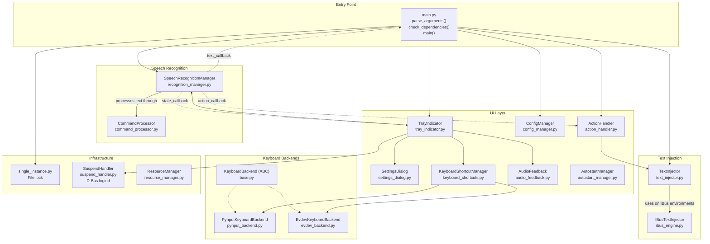
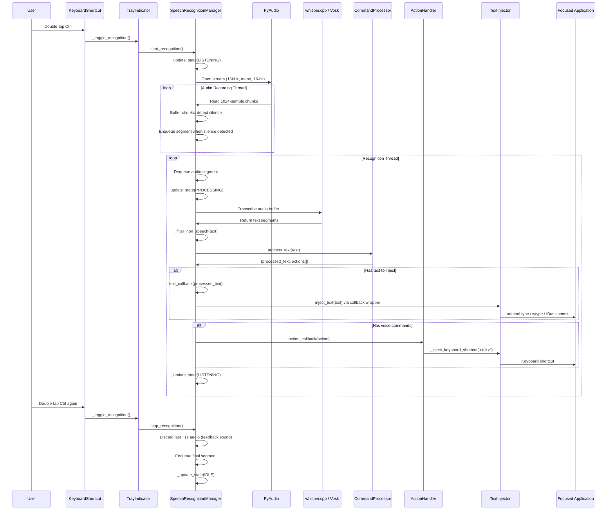
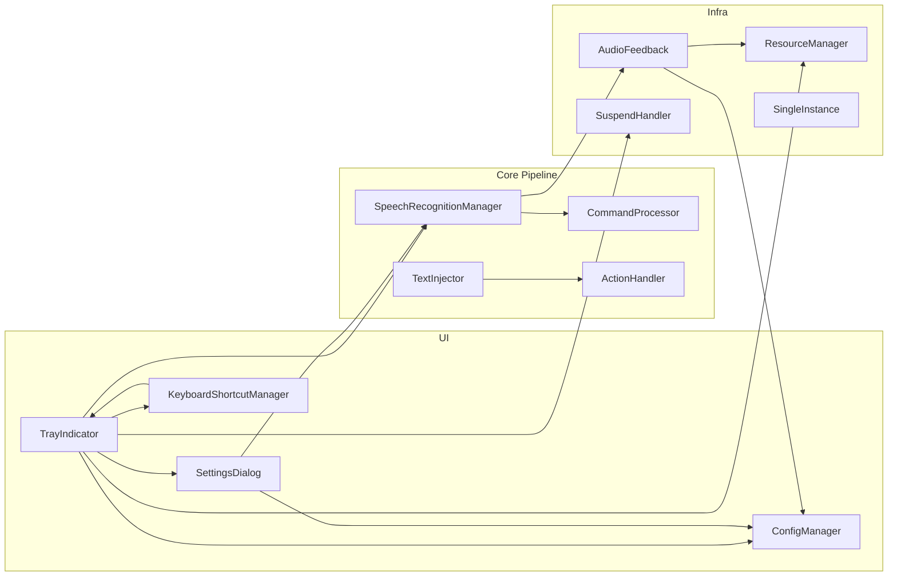

# Vocalinux — Codebase Knowledge Document

> **Generated**: 2026-04-06  
> **Version Analyzed**: 0.10.1-beta  
> **Purpose**: Complete brain-dump for LLM-assisted development, bug fixing, and refactoring.

---

## Table of Contents

1. [High-Level Overview](#1-high-level-overview)
2. [Architecture & Component Map](#2-architecture--component-map)
3. [Data Flow](#3-data-flow)
4. [Feature-by-Feature Analysis](#4-feature-by-feature-analysis)
5. [Cross-Feature Interaction Map](#5-cross-feature-interaction-map)
6. [Nuances, Subtleties & Gotchas](#6-nuances-subtleties--gotchas)
7. [Technical Reference & Glossary](#7-technical-reference--glossary)
8. [Configuration Reference](#8-configuration-reference)
9. [Testing Guide](#9-testing-guide)
10. [File Index](#10-file-index)

---

## 1. High-Level Overview

### What It Is

Vocalinux is a **free, offline voice dictation system for Linux**. It captures audio from the microphone, converts speech to text using local AI models, and injects that text into whatever application currently has focus — as if the user typed it on a keyboard.

### Target Users

- Linux desktop users who want hands-free text input
- Accessibility users (RSI prevention, motor impairments)
- Developers, writers, and anyone who prefers dictation over typing

### Business Purpose

Vocalinux fills a gap in the Linux ecosystem where Windows and macOS have built-in voice dictation but Linux historically lacks a polished, offline alternative. Key selling points:
- **100% offline** — no cloud APIs, no data leaves the machine
- **Privacy-first** — all processing happens locally
- **Multi-engine** — supports whisper.cpp (default), OpenAI Whisper, and Vosk
- **Works everywhere** — X11 and Wayland, GNOME and KDE

### Tech Stack

| Layer | Technology |
|-------|-----------|
| Language | Python 3.9+ |
| Desktop UI | GTK 3 via PyGObject |
| System Tray | AppIndicator3 / AyatanaAppIndicator3 |
| Speech (default) | whisper.cpp via `pywhispercpp` |
| Speech (alt) | OpenAI Whisper (`openai-whisper` + PyTorch) |
| Speech (alt) | Vosk (`vosk`) |
| Audio Capture | PyAudio (PortAudio bindings) |
| Text Injection (X11) | xdotool (subprocess) |
| Text Injection (Wayland) | wtype / ydotool (subprocess) |
| Text Injection (IBus) | Custom IBus engine via Unix socket IPC |
| Keyboard Shortcuts | pynput (X11) / evdev (Wayland) |
| Website | Next.js 14 + TypeScript + Tailwind CSS |
| Packaging | setuptools (pyproject.toml), pip/pipx |

### Directory Structure

```
vocalinux/
├── src/vocalinux/              # Main Python application
│   ├── main.py                 # Entry point
│   ├── version.py              # Version constants
│   ├── common_types.py         # Shared enums & protocols
│   ├── single_instance.py      # File-lock based singleton
│   ├── suspend_handler.py      # D-Bus suspend/resume handling
│   ├── speech_recognition/     # Speech-to-text engines
│   │   ├── recognition_manager.py  # Core engine (2300 lines)
│   │   └── command_processor.py    # Voice command parsing
│   ├── text_injection/         # Text output to applications
│   │   ├── text_injector.py    # Multi-backend text injection
│   │   └── ibus_engine.py      # Custom IBus input method engine
│   ├── ui/                     # User interface
│   │   ├── tray_indicator.py   # System tray icon & menu
│   │   ├── settings_dialog.py  # Settings GUI (2400 lines)
│   │   ├── config_manager.py   # JSON config persistence
│   │   ├── keyboard_shortcuts.py   # Shortcut manager
│   │   ├── keyboard_backends/  # Backend abstraction for shortcuts
│   │   │   ├── base.py         # ABC + constants
│   │   │   ├── pynput_backend.py   # X11 keyboard listener
│   │   │   └── evdev_backend.py    # Wayland keyboard listener
│   │   ├── action_handler.py   # Voice command → keyboard shortcut
│   │   ├── audio_feedback.py   # Sound effects (start/stop/error)
│   │   ├── autostart_manager.py    # XDG autostart .desktop file
│   │   ├── first_run_dialog.py # Welcome dialog
│   │   ├── logging_dialog.py   # Log viewer GUI
│   │   ├── logging_manager.py  # In-memory log storage
│   │   └── about_dialog.py     # About/credits dialog
│   ├── utils/                  # Utilities
│   │   ├── resource_manager.py # Icon/sound file resolution
│   │   ├── whispercpp_model_info.py  # whisper.cpp model metadata
│   │   └── vosk_model_info.py  # Vosk model & language metadata
│   └── resources/              # Bundled icons (SVG) & sounds (WAV)
├── tests/                      # pytest test suite (~60 files)
├── web/                        # Next.js marketing website
├── docs/                       # User documentation
├── scripts/                    # Dev/build helper scripts
├── install.sh                  # Interactive installer
├── uninstall.sh                # Uninstaller
└── pyproject.toml              # Build config & dependencies
```


---

## 2. Architecture & Component Map

### Architecture Pattern

Vocalinux uses a **layered architecture with callback-based event wiring**:

1. **Presentation Layer** — GTK system tray, settings dialog, about dialog
2. **Application Layer** — Main entry point wires components via callbacks
3. **Domain Layer** — Speech recognition, command processing, text injection
4. **Infrastructure Layer** — Audio capture, keyboard listeners, config persistence, D-Bus

There is no database. State is held in memory; configuration is a single JSON file at `~/.config/vocalinux/config.json`. Models are stored at `~/.local/share/vocalinux/models/`.

### Component Diagram (Mermaid)



### Callback Wiring (the "Nervous System")

The `main()` function in `src/vocalinux/main.py` (lines 206-449) wires all components together using three callback registrations:

| Callback | Source | Target | Purpose |
|----------|--------|--------|---------|
| `text_callback` | `SpeechRecognitionManager` | `text_callback_wrapper()` → `TextInjector.inject_text()` | Injects recognized text |
| `action_callback` | `SpeechRecognitionManager` | `ActionHandler.handle_action()` | Handles voice commands (undo, delete, etc.) |
| `state_callback` | `SpeechRecognitionManager` | `TrayIndicator._on_recognition_state_changed()` + `ActionHandler` reset | Updates UI + resets state |

### Threading Model

| Thread | Purpose | Lifetime |
|--------|---------|----------|
| **GTK main thread** | UI event loop (`Gtk.main()`) | Entire app lifetime |
| **Audio recording thread** | Captures PCM audio via PyAudio | Created per recognition session |
| **Recognition thread** | Transcribes audio segments | Created per recognition session |
| **Keyboard listener thread** | Monitors key events (pynput/evdev) | Entire app lifetime |
| **IBus socket server thread** | Listens for text injection requests | Created when IBus engine starts |
| **Model download thread** | Downloads models with progress | Created on demand |

**Thread safety mechanisms:**
- `_buffer_lock` (threading.Lock) — protects the audio buffer
- `_model_lock` (threading.Lock) — protects model access during transcription vs reconfigure
- `_segment_queue` (queue.Queue, maxsize=32) — producer-consumer between audio and recognition threads
- `GLib.idle_add()` — marshals UI updates to GTK main thread


---

## 3. Data Flow

### Voice Dictation Pipeline (Happy Path)



### Audio Data Format Through the Pipeline

1. **PyAudio capture**: 16-bit signed PCM, 16000 Hz, mono (1 channel), 1024 samples/chunk
2. **Buffer accumulation**: `list[bytes]` — each element is one chunk (2048 bytes = 1024 samples × 2 bytes)
3. **Segment queue**: Complete audio segments (silence-delimited) passed as `list[bytes]`
4. **Whisper.cpp input**: `numpy.float32` array normalized to [-1.0, 1.0] via `int16 / 32768.0`
5. **Vosk input**: Raw bytes fed chunk-by-chunk to `KaldiRecognizer.AcceptWaveform()`

### Configuration Data Flow

```
~/.config/vocalinux/config.json  ←→  ConfigManager (in-memory dict)
                                         ↕
                                    SettingsDialog (reads/writes config)
                                         ↕
                                    SpeechRecognitionManager.reconfigure()
                                    TrayIndicator.update_shortcut()
                                    AutostartManager.set_autostart()
```

---

## 4. Feature-by-Feature Analysis

### 4.1 Speech Recognition Engine Management

**Purpose**: Provide a unified interface to three different speech recognition backends.

**Files**:
- `src/vocalinux/speech_recognition/recognition_manager.py` (2300 lines) — core engine
- `src/vocalinux/utils/whispercpp_model_info.py` — whisper.cpp model metadata & GPU detection
- `src/vocalinux/utils/vosk_model_info.py` — Vosk model & language metadata

**How it works**:

The `SpeechRecognitionManager` class supports three engines, selected at initialization:

| Engine | Init Method | Transcribe Method | Model Format | Model Location |
|--------|------------|-------------------|-------------|----------------|
| `vosk` | `_init_vosk()` | Built into Vosk's `AcceptWaveform()` | Kaldi model dirs | `~/.local/share/vocalinux/models/` |
| `whisper` | `_init_whisper()` | `_transcribe_with_whisper()` | PyTorch .pt files | `~/.cache/whisper/` |
| `whisper_cpp` | `_init_whispercpp()` | `_transcribe_with_whispercpp()` | GGML .bin files | `~/.local/share/vocalinux/models/` |

**Model download**: Models are downloaded lazily (`defer_download=True` by default). The `_download_vosk_model()`, `_download_whisper_model()`, and `_download_whispercpp_model()` methods handle downloading with progress callbacks, cancellation support, and temp-file atomic writes.

**GPU acceleration**: whisper.cpp supports GPU via Vulkan and CUDA backends, detected at runtime by `detect_compute_backend()` in `whispercpp_model_info.py`. Falls back to CPU with automatic thread count detection via `psutil` and `multiprocessing.cpu_count()`.

**Audio pipeline**: Uses a producer-consumer pattern:
- `_record_audio()` thread captures audio, detects silence via energy threshold, and enqueues segments
- `_perform_recognition()` thread dequeues segments and transcribes them
- Buffer size capped at `_max_buffer_size = 5000` chunks to prevent memory issues
- Reconnection logic with exponential backoff (up to 5 attempts)

**Non-speech filtering**: `_filter_non_speech()` removes artifacts like `[BLANK_AUDIO]`, music notes, bracketed tokens, and text with <30% alphanumeric content.

### 4.2 Voice Command Processing

**Purpose**: Convert spoken commands like "new line", "period", "delete that" into actions.

**File**: `src/vocalinux/speech_recognition/command_processor.py`

**Three command categories**:

1. **Text commands** — mapped to character substitutions:
   - "new line" → `\n`, "period" → `.`, "comma" → `,`, "question mark" → `?`, etc.
   - Includes brackets: "open parenthesis" → `(`, "close bracket" → `]`, etc.

2. **Action commands** — mapped to action names dispatched to `ActionHandler`:
   - "delete that" / "scratch that" → `delete_last`
   - "undo" → `undo`, "redo" → `redo`
   - "select all", "cut", "copy", "paste" → corresponding actions

3. **Format commands** — modify the next word:
   - "capitalize word" → `Word`, "uppercase letters" → `LETTERS`
   - "all caps example" → `EXAMPLE`, "lowercase text" → `text`

**Important note**: The `process_text()` method (lines 100-305) has a **large hardcoded switch-case** matching exact phrases for test compatibility. The generic fallback logic at the bottom handles unlisted phrases but is secondary to the exact matches. This is a known technical debt area.

### 4.3 Text Injection

**Purpose**: Type recognized text into the currently focused application window.

**Files**:
- `src/vocalinux/text_injection/text_injector.py` (900 lines)
- `src/vocalinux/text_injection/ibus_engine.py` (984 lines)

**Multi-backend architecture**:

```
TextInjector._detect_environment()
    │
    ├── X11 → xdotool type --clearmodifiers
    ├── X11_IBUS → IBusTextInjector (Unix socket → VocalinuxEngine.commit_text)
    ├── WAYLAND → wtype (preferred) or ydotool
    ├── WAYLAND_IBUS → IBusTextInjector
    └── WAYLAND_XDOTOOL → xdotool via XWayland (fallback)
```

**xdotool injection** (`_inject_with_xdotool()`):
- Chunks text into 20-character segments for reliability
- Adds 100ms delays between chunks
- Uses `--clearmodifiers` flag to prevent modifier key interference
- Retries up to 2 times with 500ms delays
- Resets stuck modifiers after injection

**Wayland injection** (`_inject_with_wayland_tool()`):
- wtype uses Wayland virtual-keyboard protocol (handles Unicode natively)
- ydotool works at evdev keycode level (ASCII only)
- For non-ASCII text with ydotool, uses clipboard-paste fallback (`_inject_via_clipboard_paste()`)

**IBus injection** (`ibus_engine.py`):
- Custom IBus input method engine (`VocalinuxEngine`) that extends `IBus.Engine`
- Communicates via Unix domain socket at `~/.local/share/vocalinux-ibus/engine.sock`
- `IBusTextInjector` sends text over socket → `VocalinuxEngine.inject_text()` calls `commit_text()`
- Saves/restores previous IBus engine and XKB layout on start/stop
- Peer credential verification via `SO_PEERCRED` for security

**Fallback chain**: If primary injection fails → copy to clipboard → show notification → play error sound.

### 4.4 Keyboard Shortcuts

**Purpose**: Global hotkeys to start/stop voice recognition without touching the mouse.

**Files**:
- `src/vocalinux/ui/keyboard_shortcuts.py` — high-level manager
- `src/vocalinux/ui/keyboard_backends/base.py` — ABC + shortcut constants
- `src/vocalinux/ui/keyboard_backends/pynput_backend.py` — X11 implementation
- `src/vocalinux/ui/keyboard_backends/evdev_backend.py` — Wayland implementation

**Supported shortcuts** (defined in `base.py`):
- `ctrl+ctrl` (default), `alt+alt`, `shift+shift` — double-tap modifier keys
- Left/right variants: `ctrl_l+ctrl_l`, `alt_r+alt_r`, etc.

**Two modes**:
1. **Toggle** (default) — double-tap starts, double-tap again stops
2. **Push-to-talk** — hold key to record, release to stop

**Backend selection** (`__init__.py`):
- Wayland → prefers evdev (pynput doesn't work on Wayland)
- X11 → prefers pynput, falls back to evdev
- evdev requires user in `input` group for `/dev/input` access

### 4.5 System Tray Indicator

**Purpose**: Persistent UI showing recognition state with a menu for control.

**File**: `src/vocalinux/ui/tray_indicator.py` (668 lines)

**Visual states** (icon changes):
- `vocalinux-microphone-off` — IDLE (not listening)
- `vocalinux-microphone` — LISTENING (recording)
- `vocalinux-microphone-process` — PROCESSING (transcribing)

**Menu items**: Start/Stop Voice Typing, Start on Login (checkbox), Settings, View Logs, About, Quit

**Suspend/resume handling**: Integrates with `SuspendHandler` (D-Bus logind `PrepareForSleep` signal):
- On suspend: stops active recognition
- On resume: reinitializes speech engine after 2s, monitors `/dev/input` for device settling before restarting keyboard shortcuts

### 4.6 Settings Dialog

**Purpose**: GUI for all configuration options.

**File**: `src/vocalinux/ui/settings_dialog.py` (2400 lines)

**Tabbed interface** (5 tabs):
1. **Speech Engine** — engine selector, model size, language, model info card with download status
2. **Recognition** — VAD sensitivity (1-5), silence timeout (0.5-5.0s), voice commands toggle, test recognition
3. **Audio** — input device selector with refresh, audio level test, sound effects toggle
4. **Shortcuts** — mode (toggle/push-to-talk), shortcut key selector
5. **General** — autostart, start minimized, copy to clipboard

**Instant-apply pattern**: Settings take effect immediately when changed (no Save button). Config is persisted to disk on every change.

**Model download**: Uses `ModelDownloadDialog` — modal dialog with progress bar, speed indicator, ETA, and cancel button. Download runs in a background thread.

### 4.7 Configuration Management

**Purpose**: Persist user preferences across sessions.

**File**: `src/vocalinux/ui/config_manager.py` (368 lines)

**Storage**: JSON file at `~/.config/vocalinux/config.json`

**Default config** (key sections):
- `speech_recognition.engine`: `"whisper_cpp"` (default)
- `speech_recognition.language`: `"auto"`
- `speech_recognition.*_model_size`: per-engine model sizes
- `shortcuts.toggle_recognition`: `"ctrl+ctrl"`
- `shortcuts.mode`: `"toggle"`
- `text_injection.copy_to_clipboard`: `false`

**Migration**: Handles old config formats — migrates single `model_size` to per-engine `vosk_model_size`, `whisper_model_size`, `whisper_cpp_model_size`. Also migrates deprecated `super+super` shortcut to `ctrl+ctrl`.

### 4.8 Action Handler

**Purpose**: Execute voice commands as keyboard shortcuts.

**File**: `src/vocalinux/ui/action_handler.py` (109 lines)

**Action dispatch table**:
- `delete_last` → sends N backspace keys (where N = length of last injected text)
- `undo` → `ctrl+z`, `redo` → `ctrl+y`
- `select_all` → `ctrl+a`, `cut` → `ctrl+x`, `copy` → `ctrl+c`, `paste` → `ctrl+v`
- `select_line` → `Home+shift+End`, `select_word` → `ctrl+shift+Right`

### 4.9 Audio Feedback

**Purpose**: Play sound effects for state transitions.

**File**: `src/vocalinux/ui/audio_feedback.py` (177 lines)

**Sounds**: `start_recording.wav`, `stop_recording.wav`, `error.wav` (bundled in `resources/sounds/`)

**Player detection priority**: paplay (PulseAudio) → aplay (ALSA) → play (SoX) → mplayer

**CI handling**: Special `_is_ci_mode()` function returns mock player in GitHub Actions (but not during pytest).

### 4.10 Single Instance Lock

**Purpose**: Prevent multiple instances from running simultaneously.

**File**: `src/vocalinux/single_instance.py` (98 lines)

**Mechanism**: File lock via `fcntl.flock()` on `~/.local/share/vocalinux/instance.lock`. Non-blocking exclusive lock — second instance gets `OSError` and exits with notification.

### 4.11 Autostart

**Purpose**: Start Vocalinux automatically on user login.

**File**: `src/vocalinux/ui/autostart_manager.py` (98 lines)

**Mechanism**: Creates/removes XDG autostart desktop entry at `~/.config/autostart/vocalinux.desktop`. Detects installed command via `shutil.which("vocalinux")`.

### 4.12 Resource Management

**Purpose**: Locate bundled icons and sounds across different installation methods.

**File**: `src/vocalinux/utils/resource_manager.py` (224 lines)

**Singleton pattern** via `__new__`. Searches multiple candidate paths:
- Package resources (relative to source)
- pip/pipx installed locations
- System-wide paths (`/usr/share/vocalinux/`)
- Candidate scoring prioritizes directories with all expected files present

### 4.13 Website

**Purpose**: Marketing/documentation website at vocalinux.com.

**Directory**: `web/` — Next.js 14 app with TypeScript, Tailwind CSS, Framer Motion.

**Pages**: Home (with live demo), Install (per-distro guides), FAQ, Changelog, Alternatives comparison, Whisper model guide, GPU acceleration, Privacy policy, and many SEO-focused landing pages.


---

## 5. Cross-Feature Interaction Map

### Component Dependencies



### Key Interaction Patterns

| Interaction | How It Works |
|------------|-------------|
| **Settings → Engine reconfigure** | `SettingsDialog` calls `SpeechRecognitionManager.reconfigure()` which stops recognition, releases old model (under `_model_lock`), and initializes new engine |
| **Settings → Shortcut change** | `SettingsDialog._on_shortcut_changed()` → `TrayIndicator.update_shortcut()` → `KeyboardShortcutManager.restart_with_shortcut()` (live, no restart needed) |
| **Suspend → Resume** | `SuspendHandler` D-Bus signal → `TrayIndicator._on_system_suspend()` stops recognition → resume → 2s delay → reinit speech + monitor `/dev/input` for keyboard device settling |
| **Text injection fallback chain** | IBus commit_text → xdotool/wtype/ydotool → clipboard copy + notification → error sound |
| **Voice command flow** | SRM transcribes → `CommandProcessor.process_text()` splits into (text, actions) → text goes to `TextInjector`, actions go to `ActionHandler` → `ActionHandler` sends keyboard shortcuts via `TextInjector._inject_keyboard_shortcut()` |
| **Model download** | `SettingsDialog` → `ModelDownloadDialog` → background thread → `SpeechRecognitionManager._download_*_model()` with progress callback → `GLib.idle_add()` updates progress bar |

---

## 6. Nuances, Subtleties & Gotchas

### Things You Must Know Before Changing Code

#### 6.1 Critical Threading Issue — Model Lock

The `_model_lock` in `SpeechRecognitionManager` is **critical for preventing segfaults**. The whisper.cpp model is a C++ object via `pywhispercpp`. If `reconfigure()` sets `self.model = None` while `_transcribe_with_whispercpp()` is accessing the model on another thread, it causes a segfault. Always acquire `_model_lock` before accessing `self.model`.

**File**: `src/vocalinux/speech_recognition/recognition_manager.py`, lines 566, 750, 992

#### 6.2 Stop Sound Contamination

When stopping recognition, the stop sound would be captured by the microphone and transcribed as gibberish. The solution:
1. Stop recording (`should_record = False`)
2. Wait for audio thread to finish (`audio_thread.join(timeout=2.0)`)
3. **Discard last ~1 second** of audio buffer (15 chunks × 64ms = ~960ms)
4. Enqueue remaining buffer as final segment
5. **Then** play the stop sound

**File**: `src/vocalinux/speech_recognition/recognition_manager.py`, `stop_recognition()` method

#### 6.3 Command Processor Hardcoding

The `CommandProcessor.process_text()` method has a **large block of hardcoded if/elif statements** (lines 122-220) matching exact phrases. This was done to satisfy specific test expectations. The generic regex-based processing at the bottom (lines 222-304) handles novel phrases but is secondary. **Any new voice command must be added both to the command dictionaries AND potentially to the hardcoded block if tests check exact phrases.**

**File**: `src/vocalinux/speech_recognition/command_processor.py`

#### 6.4 IBus Socket IPC Security

The IBus text injection uses a Unix domain socket with `SO_PEERCRED` peer credential verification (`verify_peer_credentials()` in `ibus_engine.py`, line 96). Only connections from the same UID are accepted. The socket path is `~/.local/share/vocalinux-ibus/engine.sock`.

#### 6.5 Lazy Imports Everywhere

GTK-dependent modules are imported **lazily** in `main.py` — after `check_dependencies()` passes. This allows the package to be imported (e.g., for `pip install`) even when GTK typelibs aren't available. **Do not move GTK imports to module level** in files imported from `__init__.py`.

**Files**: `src/vocalinux/__init__.py` (line 3-18), `src/vocalinux/main.py` (line 263-269)

#### 6.6 AppIndicator3 Compatibility

Three different import paths for the system tray library:
1. `gi.repository.AppIndicator3` (Ubuntu)
2. `gi.repository.AyatanaAppIndicator3` (Debian, newer Ubuntu)
3. `gi.repository.AyatanaAppindicator3` (case variant)

**File**: `src/vocalinux/ui/tray_indicator.py`, lines 16-25

#### 6.7 ALSA Error Suppression

The `_setup_alsa_error_handler()` function at module level in `recognition_manager.py` uses `ctypes` to set a custom ALSA error handler that suppresses ALSA's verbose stderr output. This is loaded at import time. If you see mysterious ALSA errors in tests, this handler may be interfering.

**File**: `src/vocalinux/speech_recognition/recognition_manager.py`, lines 25-61

#### 6.8 Wayland Text Injection Limitations

- **wtype**: Requires compositor support for `zwp_virtual_keyboard_v1` protocol. GNOME Wayland does NOT support this — wtype will fail silently.
- **ydotool**: Works on all Wayland compositors but requires `ydotoold` daemon running and only handles ASCII keycodes. Non-ASCII text uses clipboard-paste fallback.
- **XWayland fallback**: xdotool works via XWayland but only for X11 applications, not native Wayland apps.

#### 6.9 Config Migration

The `ConfigManager` handles two migrations:
1. **Per-engine model sizes** — old configs had single `model_size`, new has `vosk_model_size`, `whisper_model_size`, `whisper_cpp_model_size`
2. **Deprecated shortcuts** — `super+super` → `ctrl+ctrl` (Super key removed due to conflicts with DE shortcuts)

**File**: `src/vocalinux/ui/config_manager.py`, lines 114-155

#### 6.10 Duplicate Initialization in main()

There's a **likely bug** in `main.py` — `ConfigManager()` and `initialize_logging()` are each called twice (lines 285-287 and 289). The second call overwrites the first. This appears to be accidental duplication.

**File**: `src/vocalinux/main.py`, lines 285-289

#### 6.11 Audio Device Compatibility

The recognition manager probes for supported channels (mono preferred, stereo fallback) and sample rates (16kHz preferred, with fallback chain to 44100/48000/22050/8000 Hz). If the device doesn't support 16kHz, audio is captured at native rate and resampled. Sample rate negotiation is in `_get_supported_sample_rate()`.

**File**: `src/vocalinux/speech_recognition/recognition_manager.py`, lines 104-255

#### 6.12 Test Environment Mocking

The `tests/conftest.py` does aggressive mocking:
- **All GTK/GI modules are mocked** unconditionally (`sys.modules["gi"] = MagicMock()`)
- **Known-blocking daemon threads are suppressed** — `server_thread` and `_monitor_devices` targets are silently skipped
- **Audio feedback is mocked** globally
- Tests that need real GTK behavior cannot run in CI

---

## 7. Technical Reference & Glossary

### Glossary

| Term | Definition |
|------|-----------|
| **VAD** | Voice Activity Detection — algorithm to detect when speech is present vs silence |
| **RTF** | Real-Time Factor — ratio of processing time to audio duration (RTF < 1.0 = faster than real-time) |
| **GGML** | Format for quantized ML models used by whisper.cpp |
| **IBus** | Intelligent Input Bus — Linux input method framework for CJK and other complex scripts |
| **XIM** | X Input Method — legacy X11 input method protocol |
| **evdev** | Linux kernel input event interface at `/dev/input/event*` |
| **pynput** | Python library for monitoring keyboard/mouse input (X11 only) |
| **xdotool** | X11 automation tool for simulating keyboard/mouse events |
| **wtype** | Wayland equivalent of xdotool for virtual keyboard input |
| **ydotool** | Display-server-agnostic automation tool using evdev (requires daemon) |
| **AppIndicator** | D-Bus protocol for system tray icons (Ubuntu/GNOME extension) |
| **StatusNotifierWatcher** | D-Bus service that manages system tray icons |
| **PrepareForSleep** | D-Bus signal from systemd-logind before suspend/hibernate |

### Key Classes

| Class | File | Purpose |
|-------|------|---------|
| `SpeechRecognitionManager` | `recognition_manager.py` | Core engine — manages audio capture, model loading, transcription, callbacks |
| `CommandProcessor` | `command_processor.py` | Parses voice commands from transcribed text |
| `TextInjector` | `text_injector.py` | Injects text into focused app via xdotool/wtype/ydotool/IBus |
| `IBusTextInjector` | `ibus_engine.py` | Client-side IBus integration — manages engine lifecycle |
| `VocalinuxEngine` | `ibus_engine.py` | Server-side IBus engine — receives text via socket, calls `commit_text()` |
| `VocalinuxEngineApplication` | `ibus_engine.py` | IBus application wrapper for engine registration |
| `TrayIndicator` | `tray_indicator.py` | System tray icon with GTK menu |
| `SettingsDialog` | `settings_dialog.py` | GTK dialog with tabbed settings interface |
| `ConfigManager` | `config_manager.py` | JSON-based config persistence with migration |
| `KeyboardShortcutManager` | `keyboard_shortcuts.py` | High-level shortcut management (delegates to backends) |
| `KeyboardBackend` | `base.py` | ABC for keyboard input backends |
| `PynputKeyboardBackend` | `pynput_backend.py` | pynput-based keyboard listener (X11) |
| `EvdevKeyboardBackend` | `evdev_backend.py` | evdev-based keyboard listener (Wayland) |
| `ActionHandler` | `action_handler.py` | Maps voice commands to keyboard shortcuts |
| `SuspendHandler` | `suspend_handler.py` | D-Bus logind signal handler for suspend/resume |
| `ResourceManager` | `resource_manager.py` | Singleton for locating bundled resources |
| `LoggingManager` | `logging_manager.py` | In-memory log storage with callbacks |
| `LoggingHandler` | `logging_manager.py` | Python logging.Handler that feeds LoggingManager |

### Key Protocols (Interfaces)

Defined in `src/vocalinux/common_types.py`:

| Protocol | Methods | Used By |
|----------|---------|---------|
| `SpeechRecognitionManagerProtocol` | `start_recognition()`, `stop_recognition()`, `register_state_callback()`, `register_text_callback()`, `state` | `TrayIndicator` |
| `TextInjectorProtocol` | `inject_text(text) → bool` | `TrayIndicator` |

### Key Enums

| Enum | Values | Purpose |
|------|--------|---------|
| `RecognitionState` | `IDLE`, `LISTENING`, `PROCESSING`, `ERROR` | State machine for speech engine |
| `DesktopEnvironment` (text_injector) | `X11`, `WAYLAND`, `WAYLAND_XDOTOOL`, `WAYLAND_IBUS`, `X11_IBUS` | Text injection backend selection |


---

## 8. Configuration Reference

### Config File Location

`~/.config/vocalinux/config.json`

### Full Default Configuration

```json
{
    "speech_recognition": {
        "engine": "whisper_cpp",
        "language": "auto",
        "model_size": "tiny",
        "vosk_model_size": "small",
        "whisper_model_size": "tiny",
        "whisper_cpp_model_size": "tiny",
        "vad_sensitivity": 3,
        "silence_timeout": 2.0,
        "voice_commands_enabled": null
    },
    "audio": {
        "device_index": null,
        "device_name": null
    },
    "sound_effects": {
        "enabled": true
    },
    "shortcuts": {
        "toggle_recognition": "ctrl+ctrl",
        "mode": "toggle"
    },
    "ui": {
        "start_minimized": false,
        "show_notifications": true
    },
    "general": {
        "autostart": false,
        "first_run": true
    },
    "text_injection": {
        "copy_to_clipboard": false
    },
    "advanced": {
        "debug_logging": false,
        "wayland_mode": false
    }
}
```

### Configuration Keys Explained

| Section | Key | Type | Default | Description |
|---------|-----|------|---------|-------------|
| `speech_recognition` | `engine` | str | `"whisper_cpp"` | `"vosk"`, `"whisper"`, or `"whisper_cpp"` |
| | `language` | str | `"auto"` | Language code or `"auto"` for auto-detect |
| | `voice_commands_enabled` | bool/null | `null` | `null`=auto (on for Vosk, off for Whisper) |
| | `vad_sensitivity` | int | `3` | 1 (least sensitive) to 5 (most sensitive) |
| | `silence_timeout` | float | `2.0` | Seconds of silence before processing |
| `audio` | `device_index` | int/null | `null` | PyAudio device index, `null` = system default |
| `shortcuts` | `toggle_recognition` | str | `"ctrl+ctrl"` | Shortcut key combination |
| | `mode` | str | `"toggle"` | `"toggle"` or `"push_to_talk"` |
| `text_injection` | `copy_to_clipboard` | bool | `false` | Also copy text to clipboard |
| `general` | `first_run` | bool | `true` | Shows welcome dialog on first launch |
| | `autostart` | bool | `false` | XDG autostart enabled |

### Supported Languages

Defined in `src/vocalinux/utils/vosk_model_info.py`:

| Code | Language | Vosk Model | Whisper Code |
|------|----------|-----------|-------------|
| `auto` | Auto-detect | N/A | `None` |
| `en-us` | English (US) | `vosk-model-small-en-us-0.15` | `en` |
| `en-in` | English (India) | `vosk-model-small-en-in-0.4` | `en` |
| `hi` | Hindi | `vosk-model-small-hi-0.22` | `hi` |
| `es` | Spanish | `vosk-model-small-es-0.42` | `es` |
| `fr` | French | `vosk-model-small-fr-0.22` | `fr` |
| `de` | German | `vosk-model-small-de-0.15` | `de` |
| `it` | Italian | `vosk-model-small-it-0.22` | `it` |
| `pt` | Portuguese | `vosk-model-small-pt-0.3` | `pt` |
| `ru` | Russian | `vosk-model-small-ru-0.22` | `ru` |
| `zh` | Chinese | `vosk-model-small-cn-0.22` | `zh` |

### whisper.cpp Model Sizes

Defined in `src/vocalinux/utils/whispercpp_model_info.py`:

| Model | Size (MB) | Parameters | RAM Required |
|-------|-----------|-----------|-------------|
| tiny | 75 | 39M | ~390 MB |
| base | 142 | 74M | ~500 MB |
| small | 466 | 244M | ~1.0 GB |
| medium | 1500 | 769M | ~2.6 GB |
| large | 2900 | 1550M | ~4.7 GB |

### Data Directories

| Path | Purpose |
|------|---------|
| `~/.config/vocalinux/config.json` | User configuration |
| `~/.local/share/vocalinux/models/` | Downloaded speech models |
| `~/.local/share/vocalinux/instance.lock` | Single-instance lock file |
| `~/.local/share/vocalinux-ibus/` | IBus engine socket & component XML |
| `~/.cache/whisper/` | OpenAI Whisper model cache |
| `~/.config/autostart/vocalinux.desktop` | XDG autostart entry |

---

## 9. Testing Guide

### Test Infrastructure

- **Framework**: pytest 7+ with `pytest-mock`, `pytest-cov`, `pytest-timeout`
- **Timeout**: 10 seconds per test (configured in `pyproject.toml`)
- **All GTK/GI modules are mocked** in `tests/conftest.py` — tests never create real GTK windows
- **Daemon threads suppressed** — socket server and evdev monitor threads are skipped in tests

### Running Tests

```bash
# All tests
pytest

# Single file
pytest tests/test_command_processor.py

# Single test
pytest tests/test_command_processor.py::TestCommandProcessor::test_initialization

# With coverage
pytest --cov=src --cov-report=html

# Excluding slow/integration tests
pytest -m "not slow"
pytest -m "not integration"
```

### Test Markers

| Marker | Purpose |
|--------|---------|
| `@pytest.mark.slow` | Long-running tests |
| `@pytest.mark.integration` | Integration tests |
| `@pytest.mark.audio` | Requires audio hardware |
| `@pytest.mark.tray` | Tray indicator tests (may hang headless) |

### Key Test Files (by module)

| Module | Test Files |
|--------|-----------|
| Recognition Manager | `test_recognition_manager.py`, `test_recognition_manager_core.py`, `test_recognition_manager_advanced.py`, `test_recognition_manager_device_config.py`, `test_recognition_manager_download_buffer.py`, `test_recognition_manager_downloads.py`, `test_recognition_manager_helpers.py`, `test_recognition_manager_init.py` |
| Command Processor | `test_command_processor.py` |
| Text Injector | `test_text_injector.py`, `test_text_injector_ext.py` |
| IBus Engine | `test_ibus_engine.py`, `test_ibus_engine_core.py`, `test_ibus_engine_utils.py` |
| Tray Indicator | `test_tray_indicator.py`, `test_tray_indicator_ext.py` |
| Config Manager | `test_config_manager.py`, `test_config_manager_ext.py` |
| Keyboard | `test_keyboard_shortcuts.py`, `test_keyboard_backends_ext.py`, `test_evdev_backend_ext.py`, `test_pynput_backend_ext.py` |
| Main | `test_main.py`, `test_main_args_deps.py`, `test_main_edge_cases.py` |
| Settings | `test_settings_dialog.py`, `test_settings_shortcuts.py` |

### Test Patterns

- Tests mock external dependencies (PyAudio, subprocess, vosk, whisper)
- `conftest.py` provides `mock_gi` fixture for GTK mocking
- Audio feedback module is globally mocked to prevent sound playback
- Thread safety tests verify `_buffer_lock` and `_model_lock` behavior

---

## 10. File Index

### Priority Files (read these first for any change)

| Priority | File | Lines | Purpose |
|----------|------|-------|---------|
| ★★★ | `src/vocalinux/main.py` | 450 | Entry point, wires all components |
| ★★★ | `src/vocalinux/speech_recognition/recognition_manager.py` | 2301 | Core speech engine |
| ★★★ | `src/vocalinux/text_injection/text_injector.py` | 900 | Text injection to apps |
| ★★★ | `src/vocalinux/ui/tray_indicator.py` | 668 | System tray UI |
| ★★★ | `src/vocalinux/ui/config_manager.py` | 368 | Configuration persistence |
| ★★☆ | `src/vocalinux/text_injection/ibus_engine.py` | 984 | IBus input method engine |
| ★★☆ | `src/vocalinux/ui/settings_dialog.py` | 2387 | Settings GUI |
| ★★☆ | `src/vocalinux/ui/keyboard_shortcuts.py` | 392 | Shortcut manager |
| ★★☆ | `src/vocalinux/speech_recognition/command_processor.py` | 306 | Voice command parsing |
| ★★☆ | `src/vocalinux/ui/keyboard_backends/__init__.py` | 174 | Backend factory |
| ★★☆ | `src/vocalinux/common_types.py` | 46 | Shared types & protocols |
| ★☆☆ | `src/vocalinux/ui/keyboard_backends/base.py` | 262 | Backend ABC + constants |
| ★☆☆ | `src/vocalinux/ui/keyboard_backends/evdev_backend.py` | 427 | Wayland keyboard |
| ★☆☆ | `src/vocalinux/ui/keyboard_backends/pynput_backend.py` | 257 | X11 keyboard |
| ★☆☆ | `src/vocalinux/ui/action_handler.py` | 109 | Voice command executor |
| ★☆☆ | `src/vocalinux/ui/audio_feedback.py` | 177 | Sound effects |
| ★☆☆ | `src/vocalinux/ui/logging_manager.py` | 305 | In-memory log store |
| ★☆☆ | `src/vocalinux/utils/resource_manager.py` | 224 | Resource file locator |
| ★☆☆ | `src/vocalinux/utils/whispercpp_model_info.py` | 280 | whisper.cpp model info |
| ★☆☆ | `src/vocalinux/utils/vosk_model_info.py` | 106 | Vosk model info |
| ★☆☆ | `src/vocalinux/single_instance.py` | 98 | Process lock |
| ★☆☆ | `src/vocalinux/suspend_handler.py` | 126 | Suspend/resume |
| ★☆☆ | `src/vocalinux/ui/autostart_manager.py` | 98 | XDG autostart |
| ★☆☆ | `src/vocalinux/ui/first_run_dialog.py` | 132 | Welcome dialog |
| ★☆☆ | `src/vocalinux/ui/about_dialog.py` | 364 | About dialog |
| ★☆☆ | `src/vocalinux/ui/logging_dialog.py` | 805 | Log viewer GUI |
| ★☆☆ | `tests/conftest.py` | 160 | Test configuration & mocks |

### Build & Config Files

| File | Purpose |
|------|---------|
| `pyproject.toml` | Build system, dependencies, tool config |
| `Makefile` | Dev convenience commands |
| `install.sh` | Interactive/non-interactive installer |
| `uninstall.sh` | Uninstaller |
| `.flake8` | Flake8 linter config |
| `.pre-commit-config.yaml` | Pre-commit hooks |
| `vocalinux.desktop` | Desktop entry template |

---

## Appendix: Assumptions & Open Questions

| # | Assumption / Question | Confidence |
|---|----------------------|------------|
| 1 | The duplicate `ConfigManager()` and `initialize_logging()` calls in `main.py` (lines 285-289) are accidental | High |
| 2 | The hardcoded switch-case in `CommandProcessor.process_text()` is technical debt from test-driven development | High |
| 3 | Vosk "large" model mapping to "medium" is intentional (large VOSK model unavailable) | High — commented in code |
| 4 | `__init__.py` has `__version__ = "0.1.0"` but `version.py` has `"0.10.1-beta"` — version.py is the source of truth (used by setuptools) | High |
| 5 | IBus integration may not work on all desktop environments; xdotool/wtype are the primary injection paths | Medium |

---

*End of Codebase Knowledge Document*
